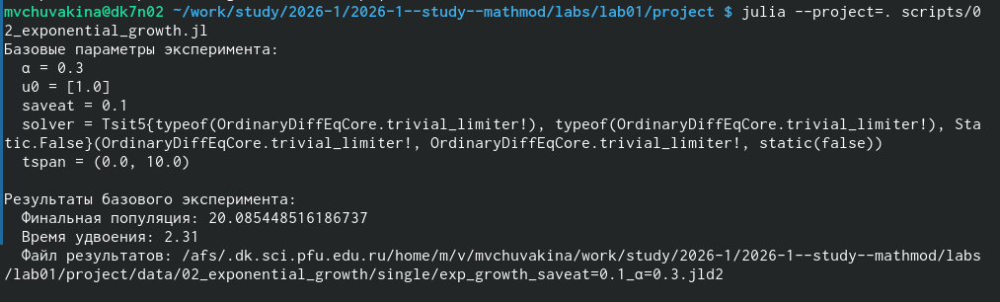
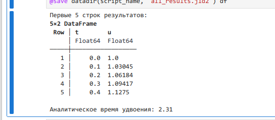
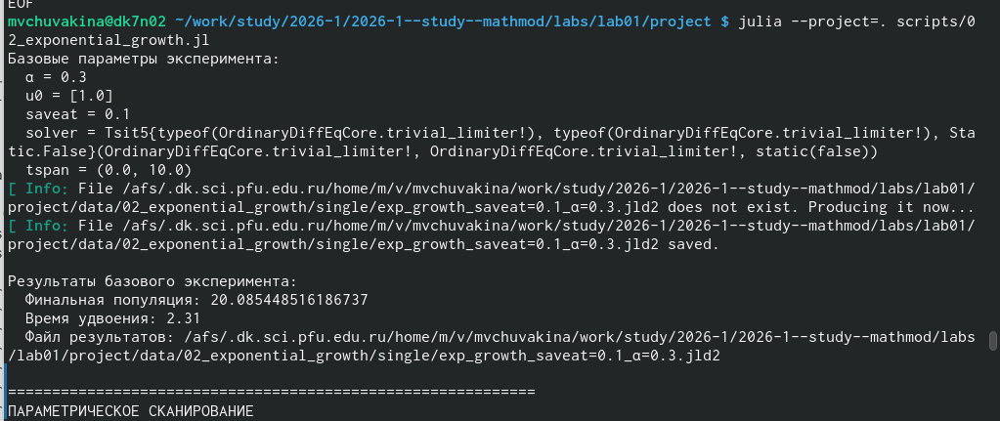

---
## Front matter
lang: ru-RU
title: Лабораторная работа №1
subtitle: Модель экспоненциального роста
author:
  - Чувакина М. В.
institute:
  - Российский университет дружбы народов, Москва, Россия
date: 17 февраля 2026

## i18n babel
babel-lang: russian
babel-otherlangs: english

## Formatting pdf
toc: false
toc-title: Содержание
slide_level: 2
aspectratio: 169
section-titles: true
theme: metropolis
header-includes:
 - \metroset{progressbar=frametitle,sectionpage=progressbar,numbering=fraction}
---

## Докладчик

:::::::::::::: {.columns align=center}
::: {.column width="70%"}

  * Чувакина Мария Владимировна
  * студентка
  * группа НКНбд-01-23
  * Российский университет дружбы народов
  * [1132236055@rudn.ru](mailto:1132236055@rudn.ru)
  * <https://github.com/mvchuvakina>

:::
::: {.column width="30%"}

:::
::::::::::::::


## Цель работы

Целью работы являлось изучение модели экспоненциального роста, её программная реализация на языке Julia, проведение параметрического исследования и освоение принципов литературного программирования.


# Выполнение лабораторной работы

## Подготовка

Ранее я уже работа с git, поэтому установка у меня уже осуществлена. Затем я создала репозиторий курса на основе шаблона и настроила Git Flow.

## Создание проекта DrWatson для лабораторных 

Перейдем в папку лабораторной работы и создадим проект DrWatson

{#fig:001 width=70%}


## Добавление необходимых пакетов

Создадим файл для установки пакетов "Вариант А: Установка скриптом"

{#fig:002 width=70%}


## Проверка установки

{#fig:003 width=70%}

## Реализация модели

Создадим папку для скриптов.

Создадим проверочный скрипт.

{#fig:004 width=70%}

## Реализация модели экспоненциального роста

Создадим первый скрипт (модель экспоненциального роста)

{#fig:005 width=70%}

## Запуск модели

Запустим модель

{#fig:006 width=70%}

## График модели

Посмотрим на график который создался

{#fig:007 width=70%}

## Генерация производных форматов

Сгенерируем производные форматы

{#fig:008 width=70%}

## Проверка файлов

Проверим созданные файлы

{#fig:009 width=70%}

## Запуск Jupyter notebook

Запустим Jupyter notebook

{#fig:010 width=70%}

## Запуск параметрический скрипт

Запустим параметрический скрипт (02_exponential_growth.jl)

{#fig:011 width=70%}

## Генерация производных форматов

Сгенерируем производные форматы для параметрического скрипта

{#fig:012 width=70%}

## Интеграция в отчет


Интегрируем в отчёт. Для этого, мы

Перейдем в папку с отчётом 

```
cd ~/work/study/2026-1/2026-1--study--simulation-modeling/labs/lab01/report
```

Отредактируем необходимые файлы.
После этого отправим изменения на GitHub

# Выводы

В процессе выполнения данной лабораторной работы я изучила модели экспоненциального роста, её программную реализацию на языке Julia, проведение параметрического исследования и освоение принципов литературного программирования.

