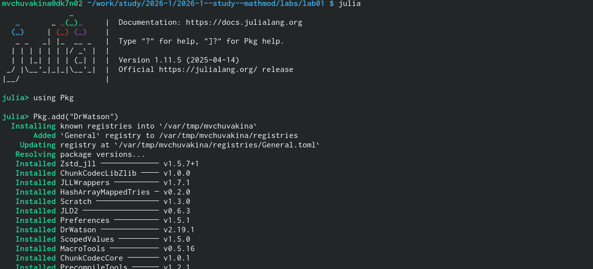
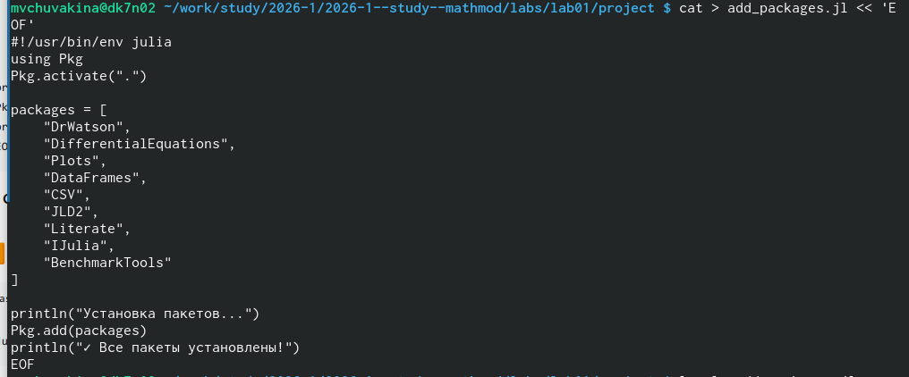
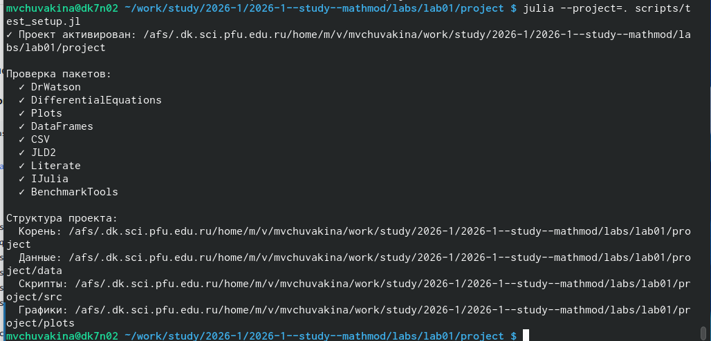
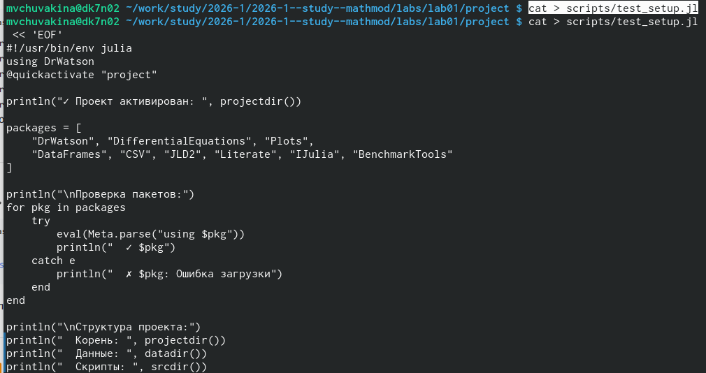
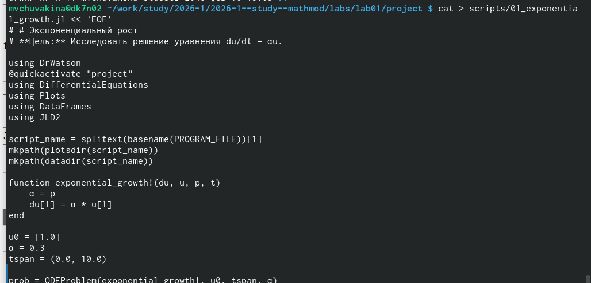
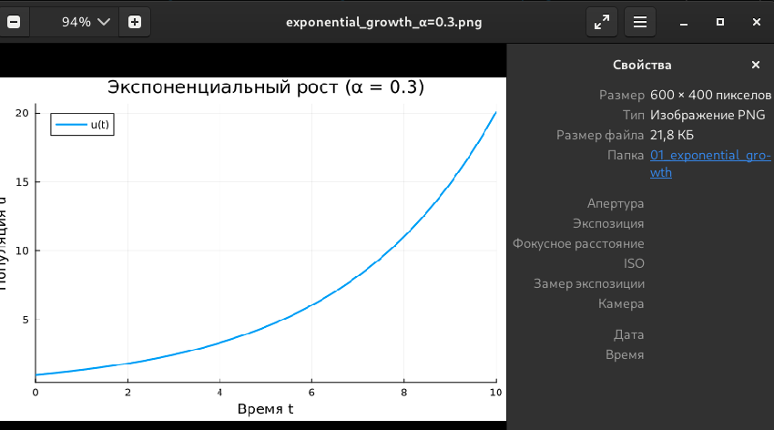
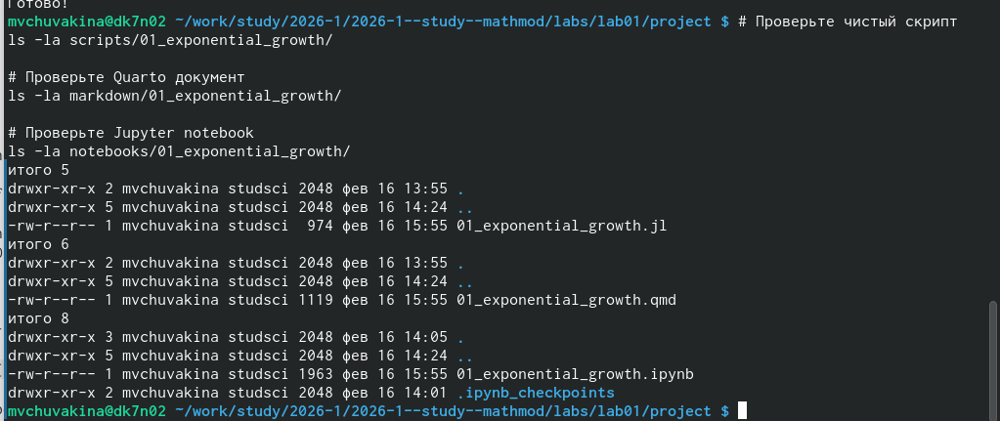
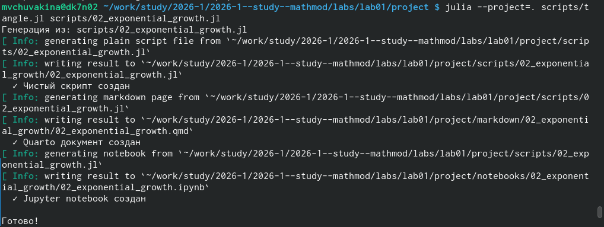

---
## Front matter
title: "Лабораторная работа №1"
subtitle: "Модель экспоненциального роста"
author: "Чувакина Мария Владимировна"

## Generic otions
lang: ru-RU
toc-title: "Содержание"

## Bibliography
bibliography: bib/cite.bib
csl: pandoc/csl/gost-r-7-0-5-2008-numeric.csl

## Pdf output format
toc: true # Table of contents
toc-depth: 2
lof: true # List of figures
lot: false # List of tables
fontsize: 12pt
linestretch: 1.5
papersize: a4
documentclass: scrreprt
## I18n polyglossia
polyglossia-lang:
  name: russian
  options:
	- spelling=modern
	- babelshorthands=true
polyglossia-otherlangs:
  name: english
## I18n babel
babel-lang: russian
babel-otherlangs: english
## Fonts
mainfont: IBM Plex Serif
romanfont: IBM Plex Serif
sansfont: IBM Plex Sans
monofont: IBM Plex Mono
mathfont: STIX Two Math
mainfontoptions: Ligatures=Common,Ligatures=TeX,Scale=0.94
romanfontoptions: Ligatures=Common,Ligatures=TeX,Scale=0.94
sansfontoptions: Ligatures=Common,Ligatures=TeX,Scale=MatchLowercase,Scale=0.94
monofontoptions: Scale=MatchLowercase,Scale=0.94,FakeStretch=0.9
mathfontoptions:
## Biblatex
biblatex: true
biblio-style: "gost-numeric"
biblatexoptions:
  - parentracker=true
  - backend=biber
  - hyperref=auto
  - language=auto
  - autolang=other*
  - citestyle=gost-numeric
## Pandoc-crossref LaTeX customization
figureTitle: "Рис."
tableTitle: "Таблица"
listingTitle: "Листинг"
lofTitle: "Список иллюстраций"
lotTitle: "Список таблиц"
lolTitle: "Листинги"
## Misc options
indent: true
header-includes:
  - \usepackage{indentfirst}
  - \usepackage{float} # keep figures where there are in the text
  - \floatplacement{figure}{H} # keep figures where there are in the text
---

# Цель работы

Целью работы являлось изучение модели экспоненциального роста, её программная реализация на языке Julia, проведение параметрического исследования и освоение принципов литературного программирования.

# Задание

1. Выполнить задания из лабораторной работы
2. Оформить отчет по лабораторной работе с помощью Markdown

# Выполнение лабораторной работы

## Подготовка

Ранее я уже работа с git, поэтому установка у меня уже осуществлена. Затем я создала репозиторий курса на основе шаблона и настроила Git Flow.

## Создание проекта DrWatson для лабораторных 

Перейдем в папку лабораторной работы и создадим проект DrWatson

{#fig:001 width=70%}


## Добавление необходимых пакетов

Создадим файл для установки пакетов "Вариант А: Установка скриптом"

```
bash

cat > add_packages.jl << 'EOF'
#!/usr/bin/env julia
using Pkg
Pkg.activate(".")

packages = [
    "DrWatson",
    "DifferentialEquations",
    "Plots",
    "DataFrames",
    "CSV",
    "JLD2",
    "Literate",
    "IJulia",
    "BenchmarkTools"
]

println("Установка пакетов...")
Pkg.add(packages)
println("✓ Все пакеты установлены!")
EOF
```

{#fig:002 width=70%}


## Проверка установки

{#fig:003 width=70%}

## Реализация модели

Создадим папку для скриптов

Создадим проверочный скрипт

{#fig:004 width=70%}

Создадим первый скрипт (модель экспоненциального роста)

{#fig:005 width=70%}

Запустим модель

{#fig:006 width=70%}

Посмотрим на график который создался

{#fig:007 width=70%}

Создадим скрипт для генерации производных форматов

```
cat > scripts/tangle.jl << 'EOF'
#!/usr/bin/env julia
using DrWatson
@quickactivate
using Literate

function main()
    if length(ARGS) == 0
        println("Использование: julia tangle.jl <путь_к_скрипту>")
        return
    end
    
    script_path = ARGS[1]
    script_name = splitext(basename(script_path))[1]
    
    println("Генерация из: $script_path")
    
    # Чистый скрипт (без комментариев)
    scripts_dir = scriptsdir(script_name)
    Literate.script(script_path, scripts_dir; credit=false)
    println("  ✓ Чистый скрипт создан")
    
    # Quarto-документ
    quarto_dir = projectdir("markdown", script_name)
    mkpath(quarto_dir)
    Literate.markdown(script_path, quarto_dir; 
                     flavor=Literate.QuartoFlavor(),
                     name=script_name, credit=false)
    println("  ✓ Quarto документ создан")
    
    # Jupyter notebook
    notebooks_dir = projectdir("notebooks", script_name)
    mkpath(notebooks_dir)
    Literate.notebook(script_path, notebooks_dir, name=script_name;
                     execute=false, credit=false)
    println("  ✓ Jupyter notebook создан")
    
    println("\nГотово!")
end

if abspath(PROGRAM_FILE) == @__FILE__
    main()
end
EOF
```


Сгенерируем производные форматы

{#fig:008 width=70%}

Проверим созданные файлы

{#fig:009 width=70%}

Запустим Jupyter notebook

{#fig:010 width=70%}

Создиадим параметрический скрипт (02_exponential_growth.jl)

```
cat > scripts/02_exponential_growth.jl << 'EOF'
# # Параметрическое исследование экспоненциального роста

using DrWatson
@quickactivate "project"
using DifferentialEquations
using DataFrames
using Plots
using JLD2
using BenchmarkTools

script_name = splitext(basename(PROGRAM_FILE))[1]
mkpath(plotsdir(script_name))
mkpath(datadir(script_name))

function exponential_growth!(du, u, p, t)
    α = p
    du[1] = α * u[1]
end

# Базовый набор параметров
base_params = Dict(
    :u0 => [1.0],
    :α => 0.3,
    :tspan => (0.0, 10.0),
    :solver => Tsit5(),
    :saveat => 0.1
)

println("Базовые параметры эксперимента:")
for (key, value) in base_params
    println("  $key = $value")
end

# Функция для запуска одного эксперимента
function run_single_experiment(params::Dict)
    u0 = params[:u0]
    α = params[:α]
    tspan = params[:tspan]
    solver = params[:solver]
    saveat = params[:saveat]
    
    prob = ODEProblem(exponential_growth!, u0, tspan, α)
    sol = solve(prob, solver; saveat=saveat)
    
    final_population = last(sol.u)[1]
    doubling_time = log(2) / α
    
    return Dict(
        "solution" => sol,
        "time_points" => sol.t,
        "population_values" => first.(sol.u),
        "final_population" => final_population,
        "doubling_time" => doubling_time,
        "parameters" => params
    )
end

# Запуск базового эксперимента
data, path = produce_or_load(
    datadir(script_name, "single"),
    base_params,
    run_single_experiment,
    prefix = "exp_growth",
    tag = false,
    verbose = true
)

println("\nРезультаты базового эксперимента:")
println("  Финальная популяция: ", data["final_population"])
println("  Время удвоения: ", round(data["doubling_time"]; digits=2))
println("  Файл результатов: ", path)

# Визуализация базового эксперимента
p1 = plot(data["time_points"], data["population_values"],
          label="α = $(base_params[:α])",
          xlabel="Время t", ylabel="Популяция u(t)",
          title="Экспоненциальный рост (базовый эксперимент)",
          lw=2, legend=:topleft, grid=true)

savefig(plotsdir(script_name, "single_experiment.png"))

# Параметрическое сканирование
param_grid = Dict(
    :u0 => [[1.0]],
    :α => [0.1, 0.3, 0.5, 0.8, 1.0],
    :tspan => [(0.0, 10.0)],
    :solver => [Tsit5()],
    :saveat => [0.1]
)

using DrWatson: dict_list
all_params = dict_list(param_grid)

println("\n" * "="^60)
println("ПАРАМЕТРИЧЕСКОЕ СКАНИРОВАНИЕ")
println("Всего комбинаций параметров: ", length(all_params))
println("Исследуемые значения α: ", param_grid[:α])
println("="^60)

# Запуск всех экспериментов
all_results = []
all_dfs = []

for (i, params) in enumerate(all_params)
    println("Прогресс: $i/$(length(all_params)) | α = $(params[:α])")
    
    data, path = produce_or_load(
        datadir(script_name, "parametric_scan"),
        params,
        run_single_experiment,
        prefix = "scan",
        tag = false,
        verbose = false
    )
    
    result_summary = merge(params, Dict(
        :final_population => data["final_population"],
        :doubling_time => data["doubling_time"],
        :filepath => path
    ))
    
    push!(all_results, result_summary)
    
    df = DataFrame(
        t = data["time_points"],
        u = data["population_values"],
        α = fill(params[:α], length(data["time_points"]))
    )
    push!(all_dfs, df)
end

# Анализ результатов
results_df = DataFrame(all_results)
println("\nСводная таблица результатов:")
println(results_df[:, [:α, :final_population, :doubling_time]])

# Сравнительный график
p2 = plot(size=(800, 500), dpi=150)

for params in all_params
    data, _ = produce_or_load(
        datadir(script_name, "parametric_scan"),
        params,
        run_single_experiment,
        prefix = "scan"
    )
    plot!(p2, data["time_points"], data["population_values"],
          label="α = $(params[:α])", lw=2, alpha=0.8)
end

plot!(p2, xlabel="Время t", ylabel="Популяция u(t)",
      title="Параметрическое исследование: влияние α на рост",
      legend=:topleft, grid=true)

savefig(plotsdir(script_name, "parametric_scan_comparison.png"))

# График зависимости времени удвоения от α
p3 = scatter(results_df.α, results_df.doubling_time,
             label="Численное решение",
             xlabel="Скорость роста α",
             ylabel="Время удвоения t₂",
             title="Зависимость времени удвоения от α",
             markersize=8, markercolor=:red, legend=:topright)

α_range = 0.1:0.01:1.0
plot!(p3, α_range, log.(2) ./ α_range,
      label="Теория: t₂ = ln(2)/α",
      lw=2, linestyle=:dash, linecolor=:blue)

savefig(plotsdir(script_name, "doubling_time_vs_alpha.png"))

# Сохранение всех результатов
@save datadir(script_name, "all_results.jld2") base_params param_grid all_params results_df
@save datadir(script_name, "all_plots.jld2") p1 p2 p3

println("\n" * "="^60)
println("ЛАБОРАТОРНАЯ РАБОТА ЗАВЕРШЕНА")
println("="^60)
println("\nРезультаты сохранены в:")
println("  - data/$(script_name)/single/ - базовый эксперимент")
println("  - data/$(script_name)/parametric_scan/ - параметрическое сканирование")
println("  - data/$(script_name)/all_results.jld2 - сводные данные")
println("  - plots/$(script_name)/ - все графики")
EOF

```

Запустим параметрический скрипт

{#fig:011 width=70%}

Сгенерируем производные форматы для параметрического скрипта

{#fig:012 width=70%}


Интегрируем в отчёт. Для этого, мы

Перейдем в папку с отчётом 

```
cd ~/work/study/2026-1/2026-1--study--simulation-modeling/labs/lab01/report
```

Отредактируем файл mathmod--lab01--report.qmd и добавьте в него:

```
markdown

## Реализация модели



## Параметрическое исследование



```

Скомпилируем отчёт:

```
bash

make

```

После этого отправим изменения на GitHub

# Выводы

В процессе выполнения данной лабораторной работы я изучила модели экспоненциального роста, её программную реализацию на языке Julia, проведение параметрического исследования и освоение принципов литературного программирования.

# Список литературы{.unnumbered}

::: {#refs}
:::
