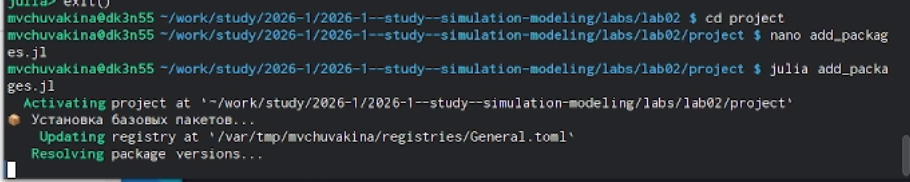

---
## Front matter
lang: ru-RU
title: Лабораторная работа №2
subtitle: Модели SIR и Лотки-Вольтерры
author:
  - Чувакина М. В.
institute:
  - Российский университет дружбы народов, Москва, Россия
date: 2 марта 2026

## i18n babel
babel-lang: russian
babel-otherlangs: english

## Formatting pdf
toc: false
toc-title: Содержание
slide_level: 2
aspectratio: 169
section-titles: true
theme: metropolis
header-includes:
 - \metroset{progressbar=frametitle,sectionpage=progressbar,numbering=fraction}
 - \usepackage{fontspec}
 - \setmainfont{FreeSerif}
 - \setsansfont{FreeSans}
 - \setmonofont{FreeMono}
 - \usepackage{polyglossia}
 - \setmainlanguage{russian}
 - \setotherlanguage{english}
---

## Докладчик

:::::::::::::: {.columns align=center}
::: {.column width="70%"}

  * Чувакина Мария Владимировна
  * студентка
  * группа НКНбд-01-23
  * Российский университет дружбы народов
  * [1132236055@rudn.ru](mailto:1132236055@rudn.ru)
  * <https://github.com/mvchuvakina>

:::
::: {.column width="30%"}

:::
::::::::::::::


# Цель работы

Исследование динамики эпидемиологического процесса с помощью модели SIR и колебательной динамики в системе «хищник-жертва» с использованием модели Лотки-Вольтерры. Освоение методов решения систем обыкновенных дифференциальных уравнений в Julia, визуализации результатов и параметрического анализа.

# Задание

1. Создать проект DrWatson для лабораторной работы
2. Реализовать модель SIR и провести её анализ
3. Реализовать модель Лотки-Вольтерры и провести её анализ
4. Преобразовать код в литературный стиль с использованием Literate.jl
5. Провести параметрическое исследование моделей
6. Интегрировать результаты в отчёт Quarto

# Теоретическое введение

## Модель SIR

Модель SIR описывается системой дифференциальных уравнений [@kermack1927contribution]:

$$
\begin{cases}
\frac{dS}{dt} = -\beta c \frac{I}{N} S \\
\frac{dI}{dt} = \beta c \frac{I}{N} S - \gamma I \\
\frac{dR}{dt} = \gamma I
\end{cases}
$$

# Теоретическое введение

где:
- $S$ — восприимчивые к инфекции
- $I$ — заразные больные
- $R$ — выздоровевшие с иммунитетом
- $\beta$ — вероятность передачи инфекции при контакте
- $c$ — среднее число контактов в день
- $\gamma$ — скорость выздоровления

Базовое репродуктивное число:
$$R_0 = \frac{c \beta}{\gamma}$$

## Модель Лотки-Вольтерры

Модель «хищник-жертва» описывается системой уравнений [@lotka1925elements]:

$$
\begin{cases}
\frac{dx}{dt} = \alpha x - \beta x y \\
\frac{dy}{dt} = \delta x y - \gamma y
\end{cases}
$$

где:
- $x$ — популяция жертв
- $y$ — популяция хищников
- $\alpha$ — скорость размножения жертв
- $\beta$ — скорость поедания жертв
- $\delta$ — коэффициент конверсии
- $\gamma$ — смертность хищников

# Выполнение лабораторной работы

## Подготовка рабочего пространства

Ранее я уже работала с git, поэтому установка у меня уже осуществлена. Репозиторий курса был создан на основе шаблона при выполнении лабораторной работы №1.

## Создание проекта DrWatson для лабораторной работы №2

Перейдем в папку лабораторной работы и создадим проект DrWatson:

{#fig:001 width=70%}

# Выполнение лабораторной работы

## Создание проекта DrWatson для лабораторной работы №2


В Julia выполним команды для создания проекта:

{#fig:002 width=70%}

# Выполнение лабораторной работы

## Добавление необходимых пакетов

Создадим файл для установки пакетов add_packages.jl:

Запустим установку пакетов

Установка заняла продолжительное время, так как было загружено и скомпилировано более 470 зависимостей.

{#fig:003 width=70%}

# Выполнение лабораторной работы

## Создание тестового скрипта

Создадим необходимые скрипты ([рис. @fig:004]).

{#fig:004 width=70%}

# Выполнение лабораторной работы


## Реализация модели SIR

Создадим файл scripts/sir_ode.jl с кодом из методички и затем преобразуем его
 в литературный стиль scripts/sir_literate.jl

# Выполнение лабораторной работы

## Запуск модель SIR

Запустим модель SIR:


{#fig:004 width=70%}

# Выполнение лабораторной работы

## Создание скрипта для модели Лотки-Вольтерры

Создадим файл scripts/lv_ode.jl с кодом из методички и затем преобразуем его
 в литературный стиль ля модели Лотки-Вольтерры scripts/lv_literate.jl

# Выполнение лабораторной работы

## Запуск модель Лотки-Вольтерры

Запустим модель Лотки-Вольтерры

Посмотрим на полученные графики:

{#fig:006 width=70%}

# Выполнение лабораторной работы

## Создание скрипта для генерации производных форматов

Создадим скрипт scripts/tangle.jl

Сгенерируем производные форматы:

```bash

julia --project=. scripts/tangle.jl scripts/sir_literate.jl
julia --project=. scripts/tangle.jl scripts/lv_literate.jl
```


# Выполнение лабораторной работы

## Параметрическое исследование SIR

Создадим скрипт для параметрического исследования модели SIR scripts/sir_parametric.jl

Запустим параметрическое исследование

## Запуск параметрического исследования для второй модели

Также создадим и для второй модели 


# Создание отчёта

Для создания отчёта был подготовлен файл report.qmd с соответствующим содержанием и преамбула preamble.tex для корректного отображения русских букв.
Компиляция отчёта выполнялась с помощью Makefile


# Выводы

В процессе выполнения данной лабораторной работы:

- Были реализованы две классические модели: SIR (эпидемиологическая) и Лотки-Вольтерры (хищник-жертва)

- Проведён анализ динамики систем при различных параметрах

- Освоены методы решения систем обыкновенных дифференциальных уравнений
- Созданы литературные скрипты с использованием Literate.jl, что позволило объединить код и документацию
- Сгенерированы производные форматы (чистый код, Jupyter notebooks, Quarto-документы)

    
Работа позволила на практике освоить основные принципы имитационного моделирования и закрепить навыки работы с языком Julia.


