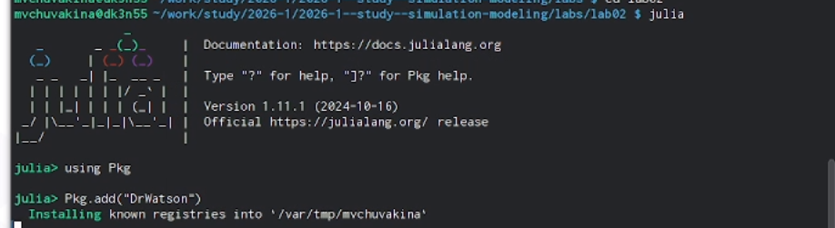
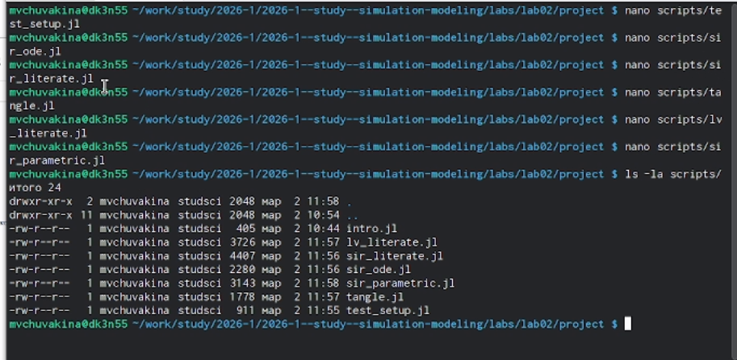
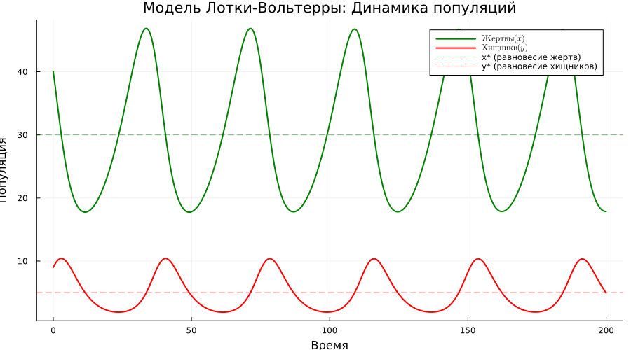

---
## Front matter
title: "Лабораторная работа №2"
subtitle: "Модели SIR и Лотки-Вольтерры"
author: "Чувакина Мария Владимировна"

## Generic otions
lang: ru-RU
toc-title: "Содержание"

## Bibliography
bibliography: bib/cite.bib
csl: pandoc/csl/gost-r-7-0-5-2008-numeric.csl

## Pdf output format
toc: true # Table of contents
toc-depth: 2
lof: true # List of figures
lot: true # List of tables
fontsize: 12pt
linestretch: 1.5
papersize: a4
documentclass: scrreprt
## I18n polyglossia
polyglossia-lang:
  name: russian
  options:
	- spelling=modern
	- babelshorthands=true
polyglossia-otherlangs:
  name: english
## I18n babel
babel-lang: russian
babel-otherlangs: english
## Fonts
mainfont: IBM Plex Serif
romanfont: IBM Plex Serif
sansfont: IBM Plex Sans
monofont: IBM Plex Mono
mathfont: STIX Two Math
mainfontoptions: Ligatures=Common,Ligatures=TeX,Scale=0.94
romanfontoptions: Ligatures=Common,Ligatures=TeX,Scale=0.94
sansfontoptions: Ligatures=Common,Ligatures=TeX,Scale=MatchLowercase,Scale=0.94
monofontoptions: Scale=MatchLowercase,Scale=0.94,FakeStretch=0.9
mathfontoptions:
## Biblatex
biblatex: true
biblio-style: "gost-numeric"
biblatexoptions:
  - parentracker=true
  - backend=biber
  - hyperref=auto
  - language=auto
  - autolang=other*
  - citestyle=gost-numeric
## Pandoc-crossref LaTeX customization
figureTitle: "Рис."
tableTitle: "Таблица"
listingTitle: "Листинг"
lofTitle: "Список иллюстраций"
lotTitle: "Список таблиц"
lolTitle: "Листинги"
## Misc options
indent: true
header-includes:
  - \usepackage{indentfirst}
  - \usepackage{float} # keep figures where there are in the text
  - \floatplacement{figure}{H} # keep figures where there are in the text
---

# Цель работы

Исследование динамики эпидемиологического процесса с помощью модели SIR и колебательной динамики в системе «хищник-жертва» с использованием модели Лотки-Вольтерры. Освоение методов решения систем обыкновенных дифференциальных уравнений в Julia, визуализации результатов и параметрического анализа.

# Задание

- Создать рабочий каталог для всего курса.
- Создать рабочее пространство для программ в рамках лабораторной работы.
- Выполнить все задания по тексту лабораторной работы.
- Установить необходимые пакеты.
- Выполнить предложенный код.
- Преобразовать код в литературный стиль.
- Сгенерировать из литературного кода:
	- чистый код;
	- jupyter notebook;
	- документацию в формате Quarto.
	- Выполнить код из jupyter notebook.
- Интегрировать документацию в формате Quarto в отчёт.
- Добавить в код в литературном стиле вычисление для набора параметров.
- Сгенерировать из литературного кода с параметрами:
	- чистый код;
	- jupyter notebook;
	- документацию в формате Quarto.
	- Выполнить код из jupyter notebook с параметрами.
- Интегрировать документацию с параметрами в формате Quarto в отчёт.

# Теоретическое введение

## Модель SIR

Модель SIR описывается системой дифференциальных уравнений [@kermack1927contribution]:

$$
\begin{cases}
\frac{dS}{dt} = -\beta c \frac{I}{N} S \\
\frac{dI}{dt} = \beta c \frac{I}{N} S - \gamma I \\
\frac{dR}{dt} = \gamma I
\end{cases}
$$

где:
- $S$ — восприимчивые к инфекции
- $I$ — заразные больные
- $R$ — выздоровевшие с иммунитетом
- $\beta$ — вероятность передачи инфекции при контакте
- $c$ — среднее число контактов в день
- $\gamma$ — скорость выздоровления

Базовое репродуктивное число:
$$R_0 = \frac{c \beta}{\gamma}$$

## Модель Лотки-Вольтерры

Модель «хищник-жертва» описывается системой уравнений [@lotka1925elements]:

$$
\begin{cases}
\frac{dx}{dt} = \alpha x - \beta x y \\
\frac{dy}{dt} = \delta x y - \gamma y
\end{cases}
$$

где:
- $x$ — популяция жертв
- $y$ — популяция хищников
- $\alpha$ — скорость размножения жертв
- $\beta$ — скорость поедания жертв
- $\delta$ — коэффициент конверсии
- $\gamma$ — смертность хищников

# Выполнение лабораторной работы

## Подготовка рабочего пространства

Ранее я уже работала с git, поэтому установка у меня уже осуществлена. Репозиторий курса был создан на основе шаблона при выполнении лабораторной работы №1.

Создаём репозиторий на основе шаблона ([рис. @fig:001]).

{#fig:001 width=70%}


## Создание проекта DrWatson для лабораторной работы №2

Перейдем в папку лабораторной работы и создадим проект DrWatson:

```bash
cd ~/work/study/2026-1/2026-1--study--simulation-modeling/labs
mkdir lab02
cd lab02
julia
```

В Julia выполним команды для создания проекта:


```julia

using Pkg
Pkg.add("DrWatson")
using DrWatson
initialize_project("project"; authors="Чувакина Мария Владимировна", git=false)
cd("project")
exit()
```

{#fig:002 width=70%}

## Добавление необходимых пакетов

Создадим файл для установки пакетов add_packages.jl:


```bash

cat > add_packages.jl << 'EOF'
#!/usr/bin/env julia
using Pkg
Pkg.activate(".")

packages = [
    "DrWatson",
    "DifferentialEquations",
    "Plots",
    "DataFrames",
    "CSV",
    "JLD2",
    "Literate",
    "IJulia",
    "BenchmarkTools",
    "Quarto",
    "StatsPlots",
    "LaTeXStrings",
    "FFTW"
]

println("Установка пакетов...")
Pkg.add(packages)
println("✓ Все пакеты установлены!")
EOF
```

Запустим установку пакетов

Установка заняла продолжительное время, так как было загружено и скомпилировано более 470 зависимостей.

{#fig:003 width=70%}

## Создание тестового скрипта

Создадим необходимые скрипты ([рис.4]).

{#fig:004 width=70%}


Создадим тестовый скрипт scripts/test_setup.jl:

```bash

mkdir -p scripts
cat > scripts/test_setup.jl << 'EOF'
#!/usr/bin/env julia
using DrWatson
@quickactivate "project"

println("✅ Проект активирован: ", projectdir())

packages = [
    "DrWatson", "DifferentialEquations", "Plots", "DataFrames",
    "CSV", "JLD2", "Literate", "IJulia", "BenchmarkTools",
    "Quarto", "StatsPlots", "LaTeXStrings", "FFTW"
]

println("\n🔍 Проверка пакетов:")
for pkg in packages
    try
        eval(Meta.parse("using $pkg"))
        println("  ✅ $pkg")
    catch e
        println("  ❌ $pkg: Ошибка загрузки")
    end
end

println("\n📁 Структура проекта:")
println("  📂 Корень: ", projectdir())
println("  📂 Данные: ", datadir())
println("  📂 Скрипты: ", srcdir())
println("  📂 Графики: ", plotsdir())
EOF
```


Запустим проверку


## Реализация модели SIR

Создадим файл scripts/sir_ode.jl с кодом из методички и затем преобразуем его
 в литературный стиль scripts/sir_literate.jl:


```bash

cat > scripts/sir_literate.jl << 'EOF'
# # Модель SIR (Susceptible-Infectious-Recovered)
#
# **Цель:** Исследовать динамику эпидемиологического процесса
# с помощью компартментальной модели SIR.

using DrWatson
@quickactivate "project"

using DifferentialEquations
using DataFrames
using StatsPlots
using LaTeXStrings
using Plots

script_name = splitext(basename(PROGRAM_FILE))[1]
mkpath(plotsdir(script_name))
mkpath(datadir(script_name))

function sir_ode!(du, u, p, t)
    (S, I, R) = u
    ( β , c, γ) = p
    N = S + I + R
    du[1] = - β  * c * I / N * S
    du[2] =  β  * c * I / N * S - γ * I 
end

# Параметры модели
δt = 0.1
tmax = 40.0
tspan = (0.0, tmax)
u0 = [990.0, 10.0, 0.0]  # S, I, R
p = [0.05, 10.0, 0.25]    # β, c, γ

R0 = (p[2] * p[1]) / p[3]

println("📊 Параметры модели SIR:")
println("  β = ", p[1])
println("  c = ", p[2])
println("  γ = ", p[3])
println("  R0 = ", round(R0, digits=3))

prob_ode = ODEProblem(sir_ode!, u0, tspan, p)
sol_ode = solve(prob_ode, dt = δt)

df_ode = DataFrame(Tables.table(sol_ode'))
rename!(df_ode, ["S", "I", "R"])
df_ode[!, :t] = sol_ode.t
df_ode[!, :N] = df_ode.S + df_ode.I + df_ode.R

plt1 = @df df_ode plot(:t, [:S :I :R],
    label=[L"S(t)" L"I(t)" L"R(t)"],
    xlabel="Время, дни", ylabel="Количество людей",
    title="Модель SIR: Динамика эпидемии",
    linewidth=2, legend=:right, grid=true, size=(800, 500))

savefig(plt1, plotsdir(script_name, "sir_main.png"))
println("\n✅ График сохранён: ", plotsdir(script_name, "sir_main.png"))
EOF
```


## Запуск модель SIR

Запустим модель SIR:

{#fig:004 width=70%}


## Создание скрипта для модели Лотки-Вольтерры

Создадим файл scripts/lv_ode.jl с кодом из методички и затем преобразуем его
 в литературный стиль ля модели Лотки-Вольтерры scripts/lv_literate.jl

```bash

cat > scripts/lv_literate.jl << 'EOF'
# # Модель Лотки-Вольтерры (хищник-жертва)
#
# **Цель:** Исследовать колебательную динамику в системе
# "хищник-жертва" с помощью модели Лотки-Вольтерры.

using DrWatson
@quickactivate "project"

using DifferentialEquations
using DataFrames
using StatsPlots
using LaTeXStrings
using Plots
using Statistics

script_name = splitext(basename(PROGRAM_FILE))[1]
mkpath(plotsdir(script_name))
mkpath(datadir(script_name))

function lotka_volterra!(du, u, p, t)
    x, y = u
    α, β, δ, γ = p
    du[1] = α*x - β*x*y
    du[2] = δ*x*y - γ*y
    nothing
end

p_lv = [0.1, 0.02, 0.01, 0.3]  # α, β, δ, γ
u0_lv = [40.0, 9.0]  # [жертвы, хищники]
tspan_lv = (0.0, 200.0)

prob_lv = ODEProblem(lotka_volterra!, u0_lv, tspan_lv, p_lv)
sol_lv = solve(prob_lv, Tsit5(), saveat=0.5)

df_lv = DataFrame(t=sol_lv.t, prey=[u[1] for u in sol_lv.u], 
                  predator=[u[2] for u in sol_lv.u])

x_star = p_lv[4] / p_lv[3]  # x* = γ/δ
y_star = p_lv[1] / p_lv[2]  # y* = α/β

println("📊 Модель Лотки-Вольтерры")
println("="^60)
println("Параметры модели:")
println("  α = ", p_lv[1])
println("  β = ", p_lv[2])
println("  δ = ", p_lv[3])
println("  γ = ", p_lv[4])
println("Стационарные точки:")
println("  x* = γ/δ = ", round(x_star, digits=2))
println("  y* = α/β = ", round(y_star, digits=2))

plt1 = plot(df_lv.t, [df_lv.prey df_lv.predator],
    label=[L"Жертвы (x)" L"Хищники (y)"],
    xlabel="Время", ylabel="Популяция",
    title="Модель Лотки-Вольтерры: Динамика популяций",
    linewidth=2, legend=:topright, grid=true, size=(900, 500),
    color=[:green :red])

hline!(plt1, [x_star], color=:green, linestyle=:dash, alpha=0.5, label="x*")
hline!(plt1, [y_star], color=:red, linestyle=:dash, alpha=0.5, label="y*")

savefig(plt1, plotsdir(script_name, "lv_dynamics.png"))

plt2 = plot(df_lv.prey, df_lv.predator,
    label="Фазовая траектория",
    xlabel="Популяция жертв (x)", ylabel="Популяция хищников (y)",
    title="Фазовый портрет системы",
    color=:blue, linewidth=1.5, grid=true, size=(800, 600),
    legend=:topright)

scatter!(plt2, [x_star], [y_star], color=:black, markersize=8, 
         label="Стационарная точка")

savefig(plt2, plotsdir(script_name, "lv_phase_portrait.png"))

println("\n✅ Графики сохранены в: ", plotsdir(script_name))
EOF
```

## Запуск модель Лотки-Вольтерры

Запустим модель Лотки-Вольтерры:

Посмотрим на полученные графики:

{#fig:006 width=70%}

Создание скрипта для генерации производных форматов

Создадим скрипт scripts/tangle.jl:

```bash

cat > scripts/tangle.jl << 'EOF'
#!/usr/bin/env julia
using DrWatson
@quickactivate
using Literate

function main()
    if length(ARGS) == 0
        println("Использование: julia tangle.jl <путь_к_скрипту>")
        return
    end
    
    script_path = ARGS[1]
    script_name = splitext(basename(script_path))[1]
    
    println("Генерация из: $script_path")
    
    scripts_dir = scriptsdir(script_name)
    Literate.script(script_path, scripts_dir; credit=false)
    println("  ✓ Чистый скрипт создан")
    
    quarto_dir = projectdir("markdown", script_name)
    mkpath(quarto_dir)
    Literate.markdown(script_path, quarto_dir; 
                     flavor=Literate.QuartoFlavor(),
                     name=script_name, credit=false)
    println("  ✓ Quarto документ создан")
    
    notebooks_dir = projectdir("notebooks", script_name)
    mkpath(notebooks_dir)
    Literate.notebook(script_path, notebooks_dir, name=script_name;
                     execute=false, credit=false)
    println("  ✓ Jupyter notebook создан")
    
    println("\nГотово!")
end

if abspath(PROGRAM_FILE) == @__FILE__
    main()
end
EOF
```

Сгенерируем производные форматы:


```bash

julia --project=. scripts/tangle.jl scripts/sir_literate.jl
julia --project=. scripts/tangle.jl scripts/lv_literate.jl
```


## Параметрическое исследование SIR

Создадим скрипт для параметрического исследования модели SIR scripts/sir_parametric.jl:


```bash

cat > scripts/sir_parametric.jl << 'EOF'
# # Параметрическое исследование модели SIR
#
# **Цель:** Исследовать влияние параметра β на динамику эпидемии.

using DrWatson
@quickactivate "project"

using DifferentialEquations
using DataFrames
using StatsPlots
using LaTeXStrings
using Plots
using JLD2

script_name = splitext(basename(PROGRAM_FILE))[1]
mkpath(plotsdir(script_name))
mkpath(datadir(script_name))

function sir_ode!(du, u, p, t)
    (S, I, R) = u
    (β, c, γ) = p
    N = S + I + R
    du[1] = -β * c * I / N * S
    du[2] = β * c * I / N * S - γ * I
    du[3] = γ * I
    nothing
end

function run_experiment(params::Dict)
    u0 = params[:u0]
    β, c, γ = params[:β], params[:c], params[:γ]
    tspan = params[:tspan]
    
    prob = ODEProblem(sir_ode!, u0, tspan, [β, c, γ])
    sol = solve(prob, Tsit5(), saveat=0.5)
    
    df = DataFrame(t=sol.t, S=[u[1] for u in sol.u],
                          I=[u[2] for u in sol.u],
                          R=[u[3] for u in sol.u])
    
    peak_idx = argmax(df.I)
    return Dict(
        "df" => df,
        "peak_time" => df.t[peak_idx],
        "peak_value" => df.I[peak_idx],
        "final_R" => df.R[end]
    )
end

base_params = Dict(
    :u0 => [990.0, 10.0, 0.0],
    :tspan => (0.0, 40.0)
)

beta_values = [0.02, 0.05, 0.08, 0.12]
c_fixed = 10.0
γ_fixed = 0.25

println("📊 Параметрическое исследование SIR")
println("="^60)
println("Исследуемые значения β: ", beta_values)

all_results = []
all_dfs = []

for β in beta_values
    params = Dict(
        :u0 => base_params[:u0],
        :tspan => base_params[:tspan],
        :β => β,
        :c => c_fixed,
        :γ => γ_fixed
    )
    
    result = run_experiment(params)
    push!(all_results, (β=β, peak=result["peak_value"],
                        peak_time=result["peak_time"],
                        final_R=result["final_R"]))
    push!(all_dfs, (β=β, df=result["df"]))
end

plt = plot(xlabel="Время, дни", ylabel="Инфицированные I(t)",
           title="Влияние β на динамику эпидемии",
           legend=:topright, grid=true, size=(800,500))

for r in all_dfs
    plot!(plt, r.df.t, r.df.I, label="β = $(r.β)", lw=2)
end

savefig(plt, plotsdir(script_name, "beta_sensitivity.png"))

println("\nРезультаты:")
for r in all_results
    println("  β = $(r.β): пик = $(round(r.peak, digits=1)) " *
            "на $(round(r.peak_time, digits=1)) день, " *
            "всего переболело = $(round(r.final_R, digits=1))")
end

@save datadir(script_name, "results.jld2") all_results
println("\n✅ График сохранён: ", plotsdir(script_name, "beta_sensitivity.png"))
EOF
```

Запустим параметрическое исследование

## Запуск параметрического исследования для второй модели

Также создадим и для второй модели 

```

# # Параметрическое исследование модели Лотки-Вольтерры
#
# **Цель:** Исследовать влияние параметров α, β, δ, γ на динамику системы
# "хищник-жертва".

using DrWatson
@quickactivate "project"

using DifferentialEquations
using DataFrames
using StatsPlots
using LaTeXStrings
using Plots
using JLD2

script_name = splitext(basename(PROGRAM_FILE))[1]
mkpath(plotsdir(script_name))
mkpath(datadir(script_name))

# ## Определение модели

function lotka_volterra!(du, u, p, t)
    x, y = u
    α, β, δ, γ = p
    du[1] = α*x - β*x*y
    du[2] = δ*x*y - γ*y
    nothing
end

# ## Функция для запуска одного эксперимента

function run_experiment(params::Dict)
    @unpack u0, α, β, δ, γ, tspan = params
    prob = ODEProblem(lotka_volterra!, u0, tspan, [α, β, δ, γ])
    sol = solve(prob, Tsit5(), saveat=0.5)
    
    df = DataFrame(t=sol.t, prey=[u[1] for u in sol.u],
                          predator=[u[2] for u in sol.u])
    
    return Dict(
        "solution" => sol,
        "df" => df,
        "mean_prey" => mean(df.prey),
        "mean_predator" => mean(df.predator),
        "max_prey" => maximum(df.prey),
        "max_predator" => maximum(df.predator)
    )
end

# ## Сетка параметров для исследования

# Базовые параметры
base_params = Dict(
    :u0 => [40.0, 9.0],
    :tspan => (0.0, 200.0)
)

# ### Исследование 1: Влияние α (скорости размножения жертв)

alpha_values = [0.05, 0.1, 0.2, 0.3]
β_fixed = 0.02
δ_fixed = 0.01
γ_fixed = 0.3

println("📊 Параметрическое исследование Лотки-Вольтерры")
println("="^60)
println("1. Влияние α (скорости размножения жертв)")
println("   α = ", alpha_values)

results_alpha = []

for α in alpha_values
    params = Dict(
        :u0 => base_params[:u0],
        :tspan => base_params[:tspan],
        :α => α,
        :β => β_fixed,
        :δ => δ_fixed,
        :γ => γ_fixed
    )
    
    result = run_experiment(params)
    push!(results_alpha, (α=α, 
                          mean_prey=result["mean_prey"],
                          mean_predator=result["mean_predator"],
                          max_prey=result["max_prey"],
                          max_predator=result["max_predator"]))
    
    # Построение графика для текущего α
    plot(result["df"].t, result["df"].prey, 
         label="α = $α", lw=2)
end

plt_alpha = plot(xlabel="Время", 
                 ylabel="Популяция жертв",
                 title="Влияние α на численность жертв",
                 legend=:topright,
                 grid=true)
current()
savefig(plotsdir(script_name, "alpha_sensitivity_prey.png"))

# Очистка и график для хищников
for α in alpha_values
    params = Dict(
        :u0 => base_params[:u0],
        :tspan => base_params[:tspan],
        :α => α,
        :β => β_fixed,
        :δ => δ_fixed,
        :γ => γ_fixed
    )
    result = run_experiment(params)
    plot!(result["df"].t, result["df"].predator, 
          label="α = $α", lw=2)
end

plt_alpha_pred = plot(xlabel="Время", 
                      ylabel="Популяция хищников",
                      title="Влияние α на численность хищников",
                      legend=:topright,
                      grid=true)
savefig(plotsdir(script_name, "alpha_sensitivity_predator.png"))

# ### Исследование 2: Влияние γ (смертности хищников)

gamma_values = [0.2, 0.3, 0.4, 0.5]
α_fixed = 0.1
β_fixed = 0.02
δ_fixed = 0.01

println("\n2. Влияние γ (смертности хищников)")
println("   γ = ", gamma_values)

results_gamma = []

for γ in gamma_values
    params = Dict(
        :u0 => base_params[:u0],
        :tspan => base_params[:tspan],
        :α => α_fixed,
        :β => β_fixed,
        :δ => δ_fixed,
        :γ => γ
    )
    
    result = run_experiment(params)
    push!(results_gamma, (γ=γ, 
                          mean_prey=result["mean_prey"],
                          mean_predator=result["mean_predator"],
                          max_prey=result["max_prey"],
                          max_predator=result["max_predator"]))
    
    plot(result["df"].t, result["df"].predator, 
         label="γ = $γ", lw=2)
end

plt_gamma = plot(xlabel="Время", 
                 ylabel="Популяция хищников",
                 title="Влияние γ на численность хищников",
                 legend=:topright,
                 grid=true)
savefig(plotsdir(script_name, "gamma_sensitivity.png"))

# ## Сводная таблица результатов

println("\n📋 Результаты исследования α:")
for r in results_alpha
    println("  α = $(r.α): ср.жертвы = $(round(r.mean_prey, digits=1)), " *
            "ср.хищники = $(round(r.mean_predator, digits=1))")
end

println("\n📋 Результаты исследования γ:")
for r in results_gamma
    println("  γ = $(r.γ): ср.жертвы = $(round(r.mean_prey, digits=1)), " *
            "ср.хищники = $(round(r.mean_predator, digits=1))")
end

# ## Сохранение результатов

@save datadir(script_name, "results_alpha.jld2") results_alpha
@save datadir(script_name, "results_gamma.jld2") results_gamma

println("\n✅ Все графики сохранены в: ", plotsdir(script_name))
println("✅ Результаты сохранены в: ", datadir(script_name))
```


Создание отчёта

Для создания отчёта был подготовлен файл report.qmd с соответствующим содержанием и преамбула preamble.tex для корректного отображения русских букв.


Компиляция отчёта выполнялась с помощью Makefile:


# Выводы

В процессе выполнения данной лабораторной работы:

- Были реализованы две классические модели: SIR (эпидемиологическая) и Лотки-Вольтерры (хищник-жертва)

- Проведён анализ динамики систем при различных параметрах

- Освоены методы решения систем обыкновенных дифференциальных уравнений в Julia с использованием пакета DifferentialEquations.jl

- Созданы литературные скрипты с использованием Literate.jl, что позволило объединить код и документацию

- Сгенерированы производные форматы (чистый код, Jupyter notebooks, Quarto-документы)

- Проведено параметрическое исследование влияния коэффициента заражения β на динамику эпидемии

Работа позволила на практике освоить основные принципы имитационного моделирования и закрепить навыки работы с языком Julia.

# Список литературы{.unnumbered}


[1] W. O. Kermack and A. G. McKendrick, "A Contribution to the Mathematical Theory of Epidemics," *Proceedings of the Royal Society of London. Series A, Containing Papers of a Mathematical and Physical Character*, vol. 115, no. 772, pp. 700–721, 1927.

[2] H. W. Hethcote, "The Mathematics of Infectious Diseases," *SIAM Review*, vol. 42, no. 4, pp. 599–653, 2000.

[3] A. J. Lotka, *Elements of Physical Biology*. Baltimore: Williams & Wilkins Company, 1925.

[4] A. J. Lotka, "Contribution to the Theory of Periodic Reaction," *The Journal of Physical Chemistry A*, vol. 14, no. 3, pp. 271–274, 1910.

[5] V. Volterra, "Variations and fluctuations of the number of individuals in animal species living together," *Journal du Conseil permanent International pour l’ Exploration de la Mer*, vol. 3, no. 1, pp. 3–51, 1928.

[6] B. Вольтерра, *Математическая теория борьбы за существование*. Москва: Наука, 1976.
