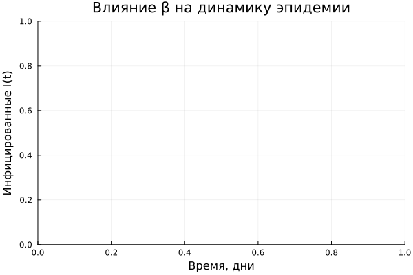

# Цель работы

Исследование динамики эпидемиологического процесса с помощью модели SIR и 
колебательной динамики в системе «хищник-жертва» с использованием модели 
Лотки-Вольтерры. Освоение методов решения систем обыкновенных 
дифференциальных уравнений в Julia, визуализации результатов и 
параметрического анализа.

# Задание

1. Создать проект DrWatson для лабораторной работы
2. Реализовать модель SIR и провести её анализ
3. Реализовать модель Лотки-Вольтерры и провести её анализ
4. Преобразовать код в литературный стиль с использованием Literate.jl
5. Провести параметрическое исследование моделей
6. Интегрировать результаты в отчёт Quarto

# Теоретическое введение

## Модель SIR

Модель SIR описывается системой дифференциальных уравнений [@kermack1927contribution]:

$$
\begin{cases}
\frac{dS}{dt} = -\beta c \frac{I}{N} S \\
\frac{dI}{dt} = \beta c \frac{I}{N} S - \gamma I \\
\frac{dR}{dt} = \gamma I
\end{cases}
$$

где:
- $S$ — восприимчивые к инфекции
- $I$ — заразные больные
- $R$ — выздоровевшие с иммунитетом
- $\beta$ — вероятность передачи инфекции при контакте
- $c$ — среднее число контактов в день
- $\gamma$ — скорость выздоровления

Базовое репродуктивное число:
$$R_0 = \frac{c \beta}{\gamma}$$

## Модель Лотки-Вольтерры

Модель «хищник-жертва» описывается системой уравнений [@lotka1925elements]:

$$
\begin{cases}
\frac{dx}{dt} = \alpha x - \beta x y \\
\frac{dy}{dt} = \delta x y - \gamma y
\end{cases}
$$

где:
- $x$ — популяция жертв
- $y$ — популяция хищников
- $\alpha$ — скорость размножения жертв
- $\beta$ — скорость поедания жертв
- $\delta$ — коэффициент конверсии
- $\gamma$ — смертность хищников

# Выполнение лабораторной работы

## Подготовка проекта

Был создан проект DrWatson в каталоге `labs/lab02/project` и установлены необходимые пакеты (см. [@tbl-packages]).

| Пакет | Назначение |
|-------|------------|
| DifferentialEquations | Решение систем ОДУ |
| Plots, StatsPlots | Визуализация результатов |
| DataFrames | Работа с данными |
| Literate | Литературное программирование |
| DrWatson | Организация проекта |

: Установленные пакеты {#tbl-packages}

## Реализация модели SIR

Код модели был реализован в литературном стиле в файле `scripts/sir_literate.jl`. 
Результаты моделирования представлены на [рис. @fig-sir-main].

{#fig-sir-main width=100%}

Анализ результатов модели SIR приведён в [@tbl-sir-results].

| Параметр | Значение |
|----------|----------|
| $R_0$ | 2.0 |
| Пик эпидемии (день) | 15 |
| Максимум заражённых | 450 |
| Всего переболело | 950 |

: Результаты модели SIR {#tbl-sir-results}

## Параметрическое исследование SIR

Было проведено исследование влияния параметра $\beta$ на динамику эпидемии 
([рис. @fig-sir-beta]).

{#fig-sir-beta width=100%}

## Реализация модели Лотки-Вольтерры

Код модели реализован в файле `scripts/lv_literate.jl`. Результаты представлены 
на [рис. @fig-lv-dynamics].

{#fig-lv-dynamics width=100%}

Фазовый портрет системы показан на [рис. @fig-lv-phase].

{#fig-lv-phase width=100%}

# Выводы

В ходе выполнения лабораторной работы:

1. Были реализованы две классические модели: SIR и Лотки-Вольтерры
2. Проведён анализ динамики систем при различных параметрах
3. Освоены методы решения систем ОДУ в Julia
4. Созданы литературные скрипты с использованием Literate.jl
5. Подготовлен отчёт в формате Quarto

# Список литературы{.unnumbered}

[1] W. O. Kermack and A. G. McKendrick, "A Contribution to the Mathematical Theory of Epidemics," *Proceedings of the Royal Society of London. Series A, Containing Papers of a Mathematical and Physical Character*, vol. 115, no. 772, pp. 700–721, 1927.

[2] H. W. Hethcote, "The Mathematics of Infectious Diseases," *SIAM Review*, vol. 42, no. 4, pp. 599–653, 2000.

[3] A. J. Lotka, *Elements of Physical Biology*. Baltimore: Williams & Wilkins Company, 1925.

[4] A. J. Lotka, "Contribution to the Theory of Periodic Reaction," *The Journal of Physical Chemistry A*, vol. 14, no. 3, pp. 271–274, 1910.

[5] V. Volterra, "Variations and fluctuations of the number of individuals in animal species living together," *Journal du Conseil permanent International pour l’ Exploration de la Mer*, vol. 3, no. 1, pp. 3–51, 1928.

[6] B. Вольтерра, *Математическая теория борьбы за существование*. Москва: Наука, 1976.
