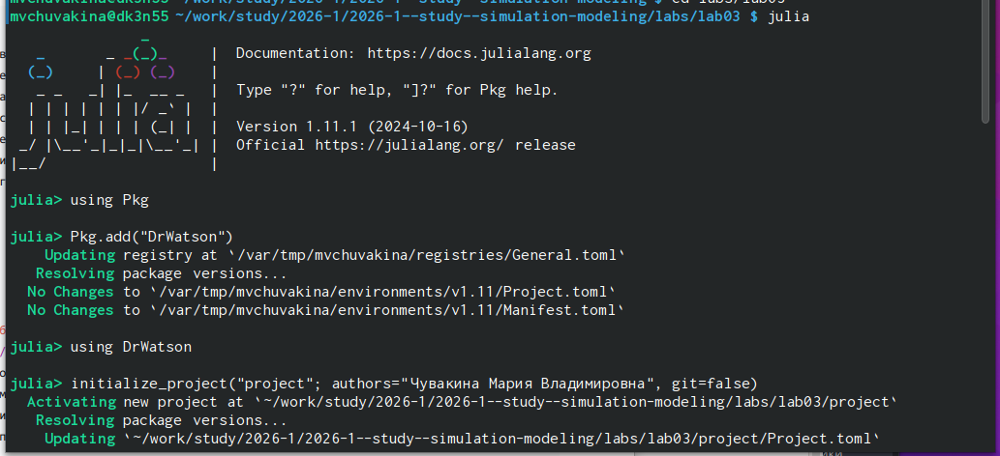
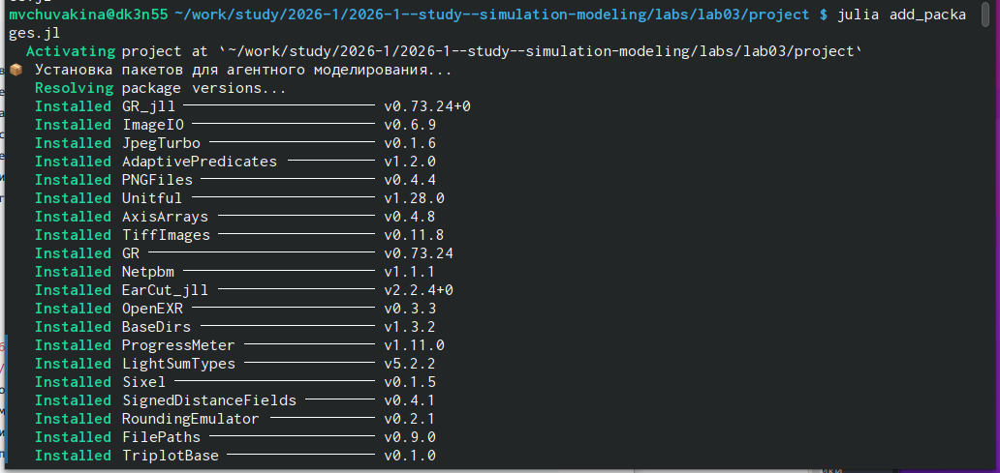
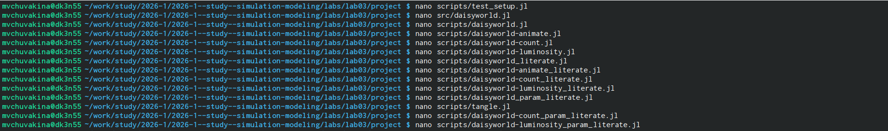
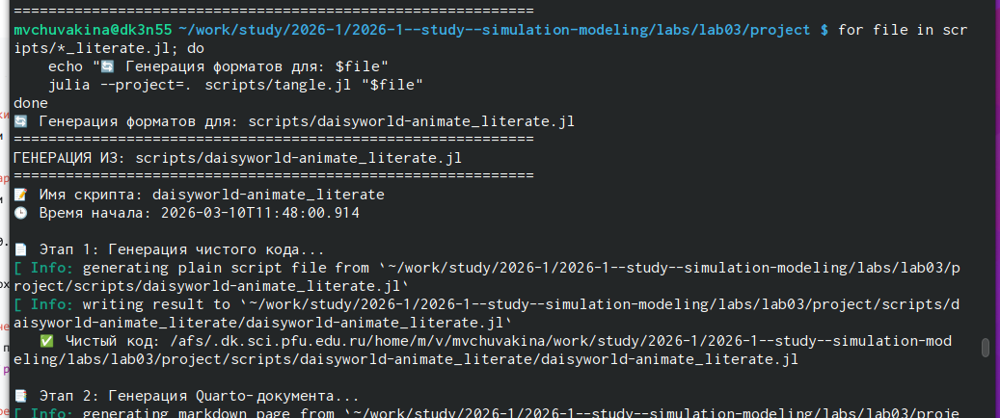
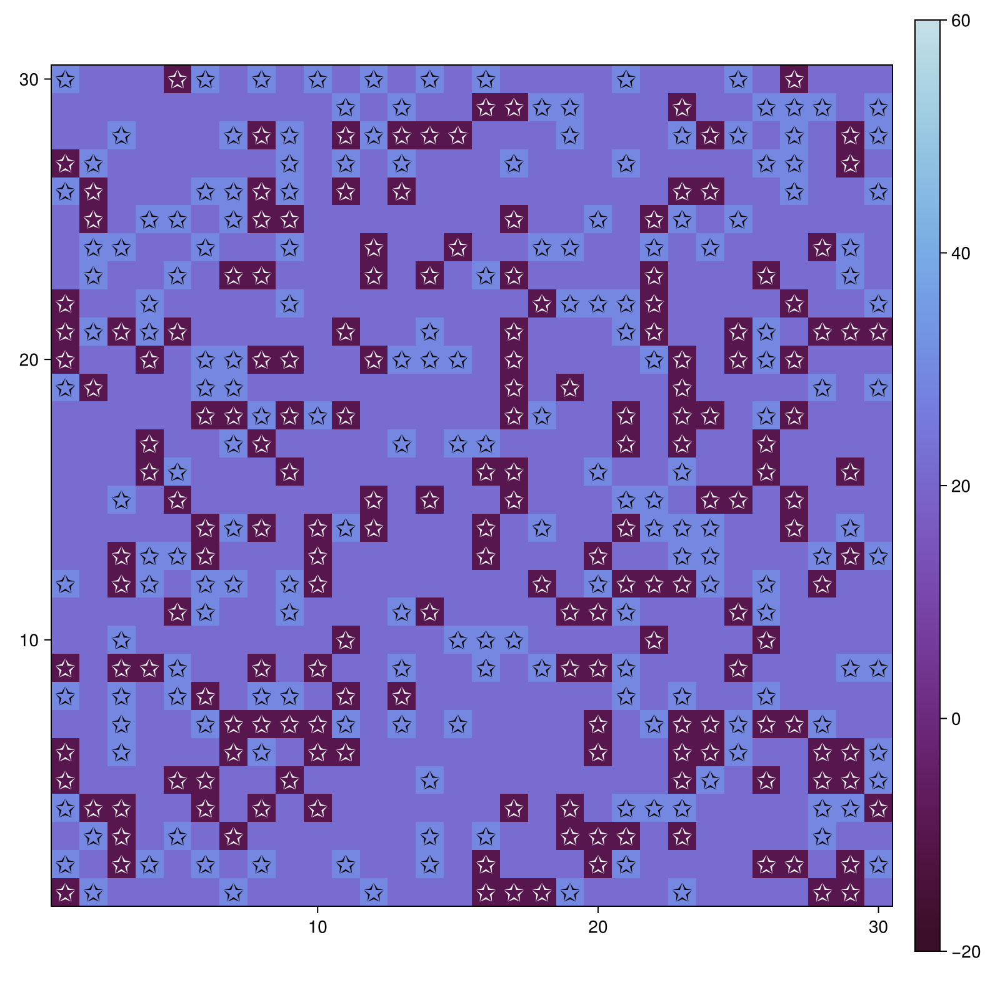
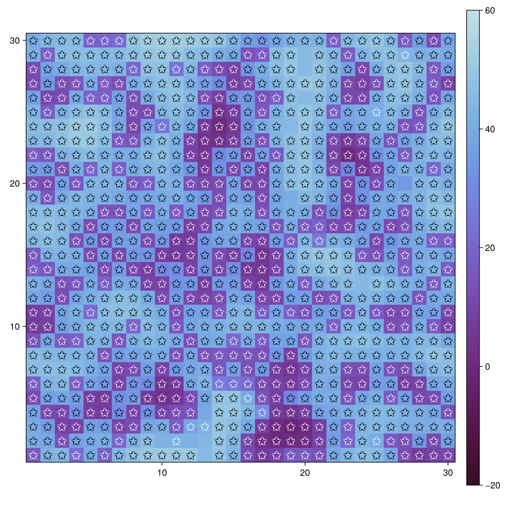
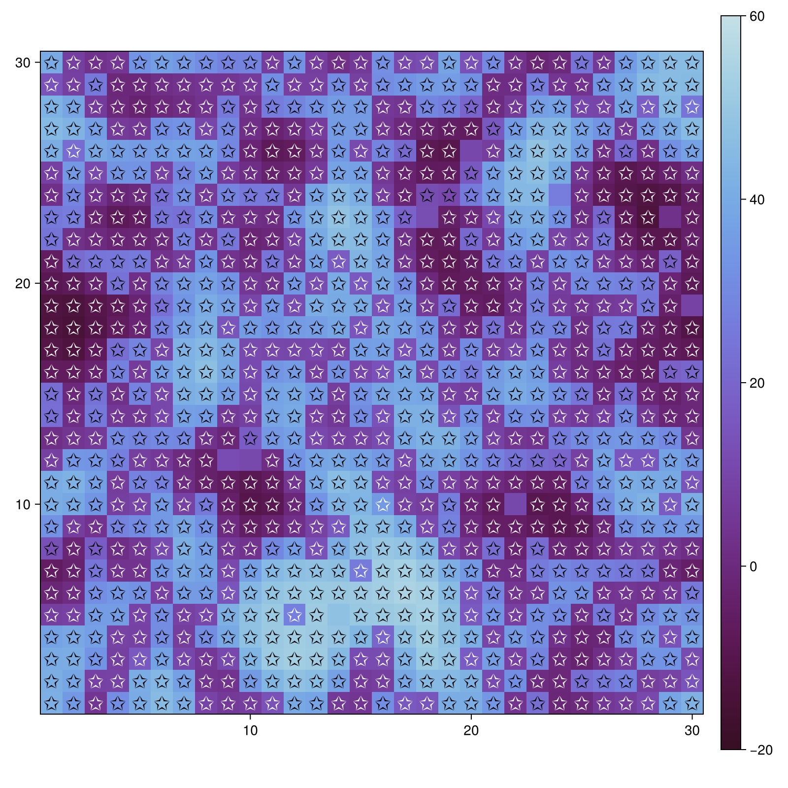
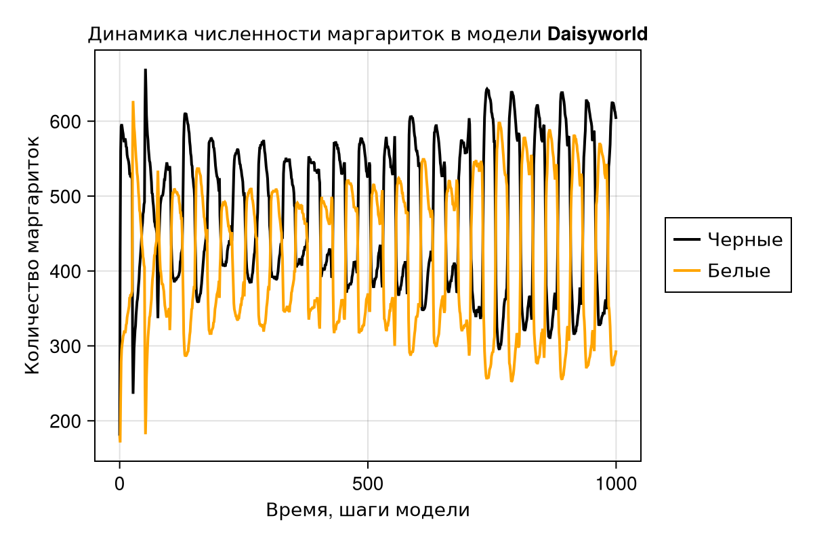
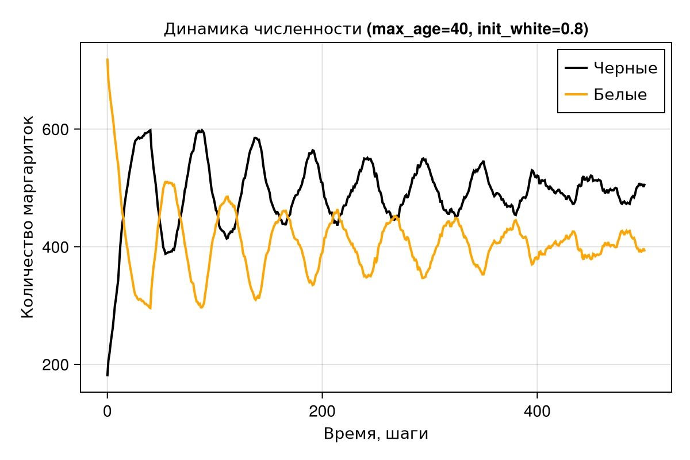

---
## Front matter
lang: ru-RU
title: Лабораторная работа №3
subtitle: "Агентное моделирование: Daisyworld"
author:
  - Чувакина М. В.
institute:
  - Российский университет дружбы народов, Москва, Россия
date: 10 марта 2026

## i18n babel
babel-lang: russian
babel-otherlangs: english

## Formatting pdf
toc: false
toc-title: Содержание
slide_level: 2
aspectratio: 169
section-titles: true
theme: metropolis
header-includes:
 - \metroset{progressbar=frametitle,sectionpage=progressbar,numbering=fraction}
 - \usepackage{fontspec}
 - \setmainfont{FreeSerif}
 - \setsansfont{FreeSans}
 - \setmonofont{FreeMono}
 - \usepackage{polyglossia}
 - \setmainlanguage{russian}
 - \setotherlanguage{english}
---

## Докладчик

:::::::::::::: {.columns align=center}
::: {.column width="70%"}

  * Чувакина Мария Владимировна
  * студентка
  * группа НКНбд-01-23
  * Российский университет дружбы народов
  * [1132236055@rudn.ru](mailto:1132236055@rudn.ru)
  * <https://github.com/mvchuvakina>

:::
::: {.column width="30%"}

:::
::::::::::::::

# 1. Цель работы

Изучить парадигму агентного моделирования, освоить основные понятия (агент, среда, правила поведения) и реализовать агентную модель «Daisyworld» на языке Julia с использованием библиотеки `Agents.jl`.

---

# 2. Задание

1. Создать рабочий каталог для кода.
2. Установить необходимые пакеты.
3. Выполнить предложенный код модели Daisyworld.
4. Преобразовать код в литературный стиль.
5. Сгенерировать из литературного кода:
   - чистый код;
   - jupyter notebook;
   - документацию в формате Quarto.
6. Выполнить код из jupyter notebook.
7. Интегрировать документацию в формате Quarto в отчёт.
8. Добавить в код в литературном стиле вычисление для набора параметров.
9. Сгенерировать из литературного кода с параметрами:
   - чистый код;
   - jupyter notebook;
   - документацию в формате Quarto.
10. Выполнить код из jupyter notebook с параметрами.
11. Интегрировать документацию с параметрами в формате Quarto в отчёт.

---

# 3. Этапы выполнения

### 3.1. Подготовка рабочего пространства

- Создан каталог `labs/lab03`

{#fig:001 width=70%}

# 3. Этапы выполнения

### 3.1. Подготовка рабочего пространства

- Создан проект DrWatson в `labs/lab03/project`

{#fig:002 width=70%}

# 3. Этапы выполнения

### 3.1. Подготовка рабочего пространства

- Установлены необходимые пакеты: `Agents.jl`, `CairoMakie`, `DataFrames`, `Literate.jl`, `StatsBase`, `JLD2`, `DrWatson` и др.

{#fig:003 width=70%}

- Проверена установка пакетов скриптом `scripts/test_setup.jl`

# 3. Этапы выполнения

### 3.2. Реализация модели Daisyworld

- Создан файл `src/daisyworld.jl` с определением агента `Daisy` и функций:
  - `update_surface_temperature!` — расчёт температуры клетки
  - `diffuse_temperature!` — диффузия температуры
  - `propagate!` — размножение маргариток
  - `daisy_step!` — шаг агента (старение и смерть)
  - `daisyworld_step!` — глобальный шаг модели
  - `daisyworld` — функция инициализации

# 3. Этапы выполнения
 
Создадим скрипты

{#fig:004 width=70%}

# 3. Этапы выполнения

#### 3.5.4. Генерация производных форматов

Сгенерируем производные форматы для всех литературных скриптов

{#fig:005 width=70%}

# 3. Этапы выполнения

### 3.6. Создание отчёта

- Создан файл `report.qmd` в папке `report/`
- Подключена преамбула `preamble.tex` для поддержки русского языка
- Добавлены все графики с подписями
- Скомпилированы report.pdf и report.docx

{#fig:006 width=70%}

### 3.7. Отправка на GitVerse и GitHub

Все изменения добавлены в Git

Создан коммит: feat: complete lab03 agent-based modeling with all analyses

Изменения отправлены на GitVerse и GitHub

# 4. Полученные результаты

#### 4.1. Базовая визуализация

На рисунках 1-3 показана эволюция модели Daisyworld на разных шагах:

Шаг 0 — начальное случайное распределение маргариток (20% чёрных, 20% белых)

{#fig:step1 width=70%}

# 4. Полученные результаты

Шаг 5 — начало самоорганизации, формируются первые кластеры

{#fig:step5 width=70%}

# 4. Полученные результаты

Шаг 45 — установление равновесия, система пришла к стабильному состоянию

{#fig:step45 width=70%}

# 4. Полученные результаты

#### 4.2. Анализ численности

График динамики численности (рис. 4) показывает, как черные и белые маргаритки конкурируют и приходят к равновесию. Чёрные маргаритки нагревают планету, создавая условия для белых, которые её охлаждают — возникает отрицательная обратная связь, обеспечивающая саморегуляцию.

{#fig:count width=100%}

# 4. Полученные результаты

#### 4.3. Влияние солнечной активности

Сценарий ramp

# 4. Полученные результаты

{#fig:luminosity-ramp width=100%}

# 4. Полученные результаты

Солнечная активность сначала растёт (шаги 200-400), затем остаётся постоянной, потом снижается (шаги 500-750). Система успевает адаптироваться к изменениям, численность маргариток колеблется, но температура остаётся в пригодных пределах.
Сценарий change 

Солнечная активность постоянно растёт. При превышении критического уровня маргаритки погибают, система теряет способность к саморегуляции.

# 4. Полученные результаты

{#fig:luminosity-change width=100%}

# 4. Полученные результаты

### 4.4. Параметрические исследования

#### 4.4.1. Базовая параметрическая визуализация

Исследованы четыре комбинации параметров (рис. 7-10):

- max_age=25, init_white=0.2

- max_age=25, init_white=0.8

- max_age=40, init_white=0.2

- max_age=40, init_white=0.8

# 4. Полученные результаты

{#fig:param1 width=100%}

# 4. Полученные результаты

{#fig:param2 width=100%}

# 4. Полученные результаты

{#fig:param3 width=100%}

# 4. Полученные результаты

{#fig:param4 width=100%}

# 4. Полученные результаты

#### 4.4.3. Комплексное параметрическое исследование

Графики, показывающие численность, температуру и солнечную активность для всех комбинаций 

Выводы из параметрического исследования:

- Увеличение max_age делает популяцию более стабильной

- Начальная доля белых (init_white) сильно влияет на переходный процесс

- Система стремится к равновесию независимо от начальных условий

- Наибольшая общая численность достигается при max_age=40

# 5. Выводы

В ходе выполнения лабораторной работы:

- Освоены основные понятия агентного моделирования: агент, среда, правила поведения, эмерджентность.

- Изучен пакет Agents.jl — основной инструмент для агентного моделирования в Julia.

- Реализована модель Daisyworld, демонстрирующая саморегуляцию климата через взаимодействие чёрных и белых маргариток.

- Проведён анализ динамики системы при различных значениях параметров.

- Освоено литературное программирование с использованием Literate.jl — созданы скрипты, объединяющие код и документацию.

Работа позволила на практике освоить принципы агентного моделирования и закрепить навыки работы с языком Julia.

