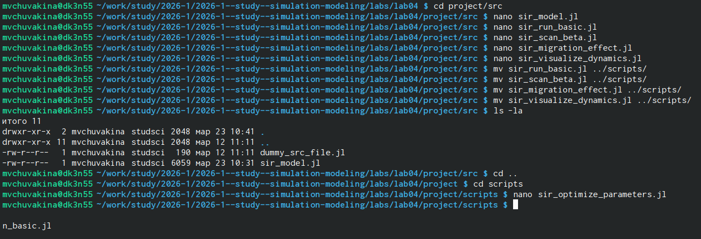
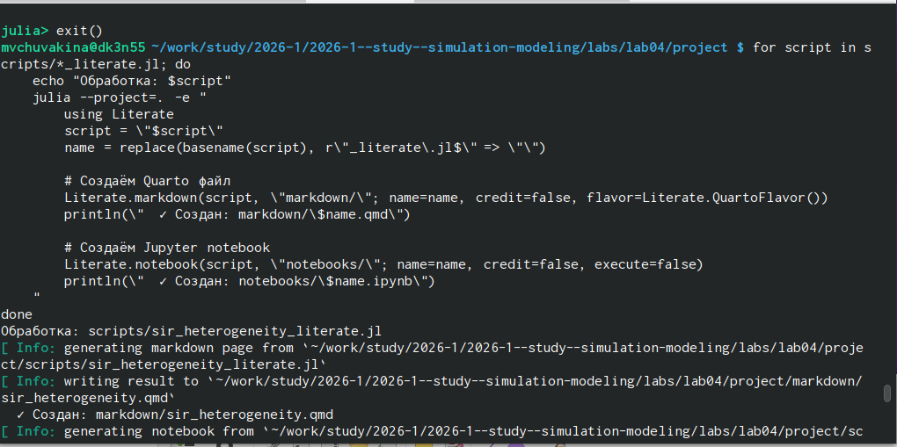

---
## Front matter
lang: ru-RU
title: Лабораторная работа №4
subtitle: "Агентное моделирование: SIR"
author:
  - Чувакина М. В.
institute:
  - Российский университет дружбы народов, Москва, Россия
date: 24 марта 2026

## i18n babel
babel-lang: russian
babel-otherlangs: english

## Formatting pdf
toc: false
toc-title: Содержание
slide_level: 2
aspectratio: 169
section-titles: true
theme: metropolis
header-includes:
 - \metroset{progressbar=frametitle,sectionpage=progressbar,numbering=fraction}
 - \usepackage{fontspec}
 - \setmainfont{FreeSerif}
 - \setsansfont{FreeSans}
 - \setmonofont{FreeMono}
 - \usepackage{polyglossia}
 - \setmainlanguage{russian}
 - \setotherlanguage{english}
---

## Докладчик

:::::::::::::: {.columns align=center}
::: {.column width="70%"}

  * Чувакина Мария Владимировна
  * студентка
  * группа НКНбд-01-23
  * Российский университет дружбы народов
  * [1132236055@rudn.ru](mailto:1132236055@rudn.ru)
  * <https://github.com/mvchuvakina>

:::
::: {.column width="30%"}

:::
::::::::::::::

# 1. Цель работы

Изучить парадигму агентного моделирования, освоить основные понятия (агент, среда, правила поведения) и реализовать агентную эпидемиологическую модель SIR на языке Julia с использованием библиотеки `Agents.jl`.

---

# 2. Задание

1. Создать рабочий каталог для кода.
2. Установить необходимые пакеты.
3. Выполнить предложенный код модели SIR.
4. Преобразовать код в литературный стиль.
5. Сгенерировать из литературного кода:
   - чистый код;
   - jupyter notebook;
   - документацию в формате Quarto.
6. Выполнить код из jupyter notebook.

# 2. Задание

7. Интегрировать документацию в формате Quarto в отчёт.
8. Добавить в код в литературном стиле вычисление для набора параметров.
9. Сгенерировать из литературного кода с параметрами:
   - чистый код;
   - jupyter notebook;
   - документацию в формате Quarto.
10. Выполнить код из jupyter notebook с параметрами.
11. Интегрировать документацию с параметрами в формате Quarto в отчёт.

---

# 3. Этапы выполнения

### 3.1. Подготовка рабочего пространства

- Создан каталог `labs/lab04`

{#fig:001 width=70%}

# 3. Этапы выполнения

### 3.1. Подготовка рабочего пространства

- Создан проект DrWatson в `labs/lab04/project`

{#fig:002 width=70%}

# 3. Этапы выполнения

### 3.1. Подготовка рабочего пространства

- Установлены необходимые пакеты: `Agents.jl`, `DataFrames`, `Plots.jl`, `CSV.jl`, `JLD2.jl`, `BlackBoxOptim.jl`, `StatsBase.jl`, `Distributions.jl`, `Literate.jl`, `DrWatson` и др.

{#fig:003 width=70%}

- Проверена установка пакетов

# 3. Этапы выполнения

### 3.2. Реализация модели SIR

- Создан файл `src/sir_model.jl` с определением:
  - Агента `Person` с полями `days_infected` и `status`
  - Функции `initialize_sir` для инициализации модели
  - Функций шага агента: `migrate!`, `transmit!`, `recover_or_die!`
  - Вспомогательных функций для сбора данных

# 3. Этапы выполнения
 
### 3.3. Базовые скрипты

Созданы и запущены скрипты:

{#fig:004 width=70%}

# 3. Этапы выполнения

### 3.4. Дополнительные задания

- **Исследование порога эпидемии** (`sir_threshold_study.jl`)
- **Эффект гетерогенности** (`sir_heterogeneity.jl`)
- **Карантинные меры** (`sir_quarantine.jl`)
- **Оптимизация параметров** (`sir_optimize_parameters.jl`, `sir_optimize_constrained.jl`)

# 3. Этапы выполнения

### 3.5. Литературное программирование

Созданы литературные версии всех скриптов (`*_literate.jl`) с подробными Markdown-комментариями.

С помощью `scripts/tangle.jl` сгенерированы:
- Чистый код в папку `scripts/`
- Jupyter notebooks в папку `notebooks/`
- Quarto-документы в папку `markdown/`

{#fig:005 width=70%}

# 3. Этапы выполнения

#### 3.5.1. Генерация производных форматов

Сгенерированы производные форматы для всех литературных скриптов

{#fig:006 width=70%}

# 3. Этапы выполнения

### 3.6. Создание отчёта

- Создан файл `report.qmd` в папке `report/`
- Добавлены все графики с подписями
- Скомпилированы report.pdf и report.docx

{#fig:007 width=70%}

### 3.7. Отправка на GitVerse и GitHub

- Все изменения добавлены в Git
- Создан коммит: `feat: complete lab04 agent-based SIR model with all analyses`
- Изменения отправлены на GitVerse и GitHub

# 4. Полученные результаты

### 4.1. Базовый эксперимент

{#fig:basic width=100%}

# 4. Полученные результаты

### 4.1. Базовый эксперимент

**Базовое репродуктивное число:**

$$R_0 = \frac{\beta}{\gamma} = \frac{0.5}{1/14} = 7.0$$

При $R_0 = 7.0 > 1$ эпидемия развивается очень быстро. Пик заболеваемости достигается на 15-й день.

# 4. Полученные результаты

### 4.2. Влияние коэффициента заразности β

{#fig:beta-scan width=100%}

**Выводы:**
- При β < 0.3 эпидемия не возникает (пик < 5%)
- При β = 0.5 пик достигает ~100% населения
- Доля умерших растёт пропорционально β

# 4. Полученные результаты

### 4.3. Исследование порога эпидемии

{#fig:threshold_study width=100%}

**Результаты:**
- Теоретический порог: β_crit = 0.0714 (R₀ = 1)
- Экспериментальный порог: β_exp ≈ 0.07-0.08

# 4. Полученные результаты

### 4.4. Эффект гетерогенности

Три сценария с разными значениями β для городов:

| Сценарий | Город 1 | Город 2 | Город 3 |
|----------|---------|---------|---------|
| Одинаковая | 0.5 | 0.5 | 0.5 |
| Разная | 0.2 | 0.5 | 0.8 |
| Один очаг | 0.8 | 0.2 | 0.2 |

# 4. Полученные результаты

### 4.5. Влияние миграции

{#fig:migration-time width=100%}

{#fig:migration-peak width=100%}

# 4. Полученные результаты

### 4.5. Влияние миграции

**Результаты:**
- При отсутствии миграции инфекция не выходит за пределы первого города
- С ростом миграции время до пика уменьшается
- Оптимальная интенсивность для быстрого распространения: **0.3-0.4**

# 4. Полученные результаты

### 4.6. Карантинные меры

{#fig:quarantine_effect width=100%}

**Результаты:**
- Пик без карантина: **~3000**
- Пик с карантином: **~2500**
- Снижение пика: **~17%** (умеренно эффективно)

# 4. Полученные результаты

### 4.7. Оптимизация параметров

#### Многокритериальная оптимизация

| Параметр | Оптимальное значение |
|----------|---------------------|
| β_und | 0.355 |
| Время выявления | 4 дня |
| Смертность | 4.6% |

**Показатели:** пик 0.04%, смертность 0.0%

# 4. Полученные результаты

### 4.7. Оптимизация параметров

#### Оптимизация с ограничением (пик < 30%)

| Параметр | Оптимальное значение |
|----------|---------------------|
| β_und | 0.35-0.40 |
| Время выявления | 3-5 дней |
| Смертность | 4-5% |

**Вывод:** для сдерживания эпидемии необходимо β < 0.4 и раннее выявление (3-5 дней)

# 5. Выводы

В ходе выполнения лабораторной работы:

- Освоены основные понятия агентного моделирования: агент, среда, правила поведения, эмерджентность.

- Изучен пакет Agents.jl — основной инструмент для агентного моделирования в Julia.

- Реализована агентная модель SIR, описывающая распространение инфекционного заболевания.

- Проведён анализ динамики системы при различных значениях параметров (β, интенсивность миграции, карантинные меры).

# 5. Выводы

- Определён порог эпидемии: минимальное β ≈ 0.07-0.08, что соответствует теоретическому порогу R₀ = 1.

- Исследована гетерогенность популяции — разная заразность в городах приводит к неравномерному распространению инфекции.

- Изучено влияние миграции на скорость распространения эпидемии.

- Модифицирована модель с карантинными мерами — оценена эффективность закрытия городов.

# 5. Выводы

- Проведена многокритериальная оптимизация параметров для минимизации пиковой заболеваемости и доли умерших.

- Освоено литературное программирование с использованием Literate.jl — созданы скрипты, объединяющие код и документацию.

- Сгенерированы производные форматы: чистый код, Jupyter notebooks, Quarto-документы.

- Подготовлен отчёт в форматах PDF и DOCX.

- Результаты отправлены на GitVerse.

Работа позволила на практике освоить принципы агентного моделирования эпидемиологических процессов и закрепить навыки работы с языком Julia и пакетом Agents.jl.
