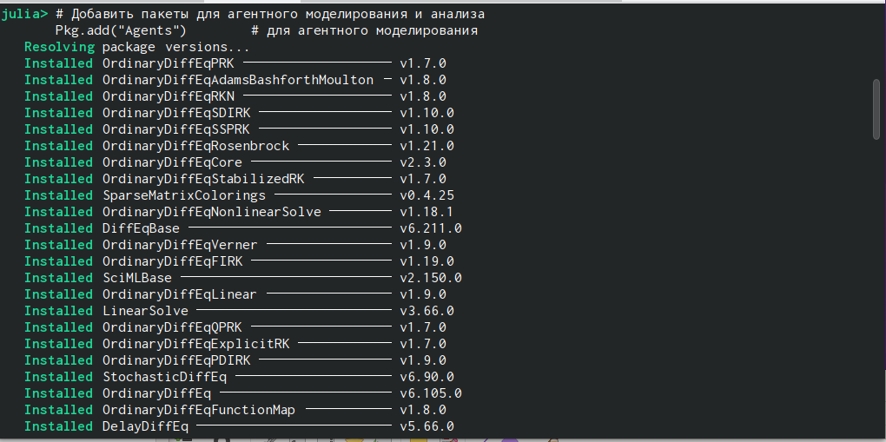
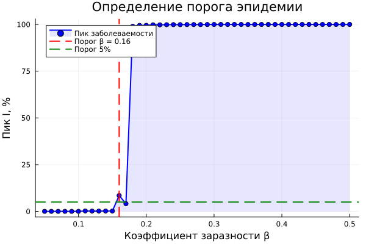
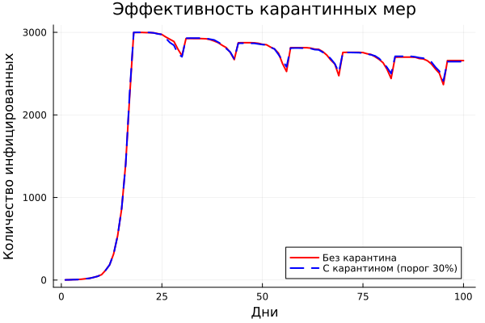
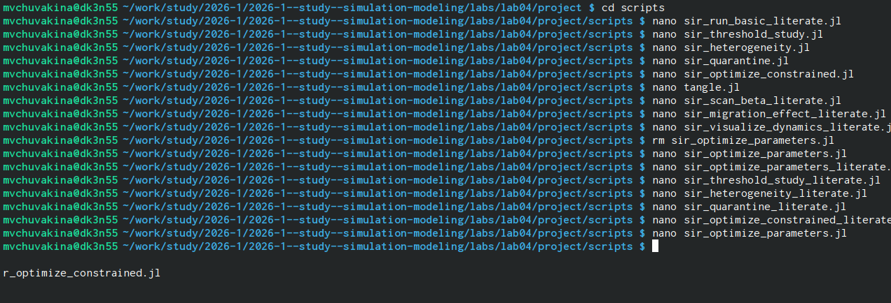
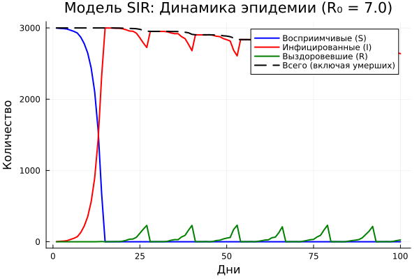
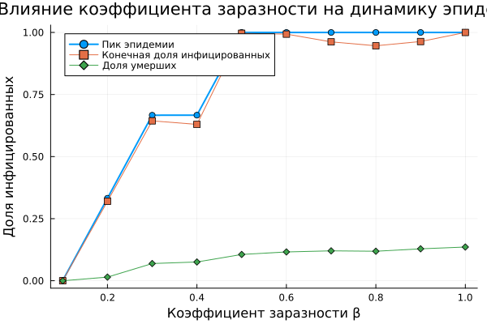
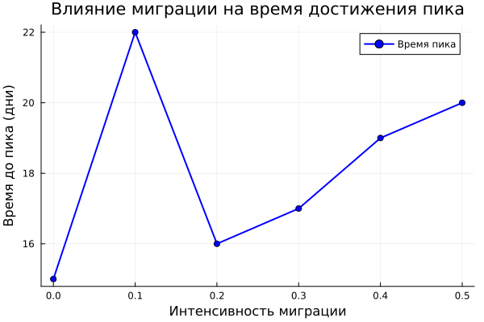
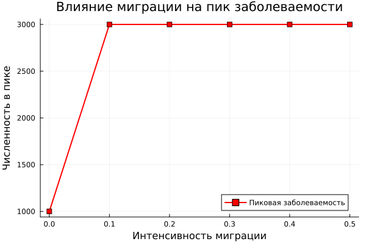

---
## Front matter
title: "Лабораторная работа №4"
subtitle: "Агентное моделирование: SIR"
author: "Чувакина Мария Владимировна"

## Generic otions
lang: ru-RU
toc-title: "Содержание"

## Bibliography
bibliography: bib/cite.bib
csl: pandoc/csl/gost-r-7-0-5-2008-numeric.csl

## Pdf output format
toc: true # Table of contents
toc-depth: 2
lof: true # List of figures
lot: true # List of tables
fontsize: 12pt
linestretch: 1.5
papersize: a4
documentclass: scrreprt
## I18n polyglossia
polyglossia-lang:
  name: russian
  options:
	- spelling=modern
	- babelshorthands=true
polyglossia-otherlangs:
  name: english
## I18n babel
babel-lang: russian
babel-otherlangs: english
## Fonts
mainfont: IBM Plex Serif
romanfont: IBM Plex Serif
sansfont: IBM Plex Sans
monofont: IBM Plex Mono
mathfont: STIX Two Math
mainfontoptions: Ligatures=Common,Ligatures=TeX,Scale=0.94
romanfontoptions: Ligatures=Common,Ligatures=TeX,Scale=0.94
sansfontoptions: Ligatures=Common,Ligatures=TeX,Scale=MatchLowercase,Scale=0.94
monofontoptions: Scale=MatchLowercase,Scale=0.94,FakeStretch=0.9
mathfontoptions:
## Biblatex
biblatex: true
biblio-style: "gost-numeric"
biblatexoptions:
  - parentracker=true
  - backend=biber
  - hyperref=auto
  - language=auto
  - autolang=other*
  - citestyle=gost-numeric
## Pandoc-crossref LaTeX customization
figureTitle: "Рис."
tableTitle: "Таблица"
listingTitle: "Листинг"
lofTitle: "Список иллюстраций"
lotTitle: "Список таблиц"
lolTitle: "Листинги"
## Misc options
indent: true
header-includes:
  - \usepackage{indentfirst}
  - \usepackage{float} # keep figures where there are in the text
  - \floatplacement{figure}{H} # keep figures where there are in the text
---

## 1. Цель работы

Изучить парадигму агентного моделирования, освоить основные понятия (агент, среда, правила поведения) и реализовать агентную эпидемиологическую модель SIR на языке Julia с использованием библиотеки `Agents.jl`.

---

## 2. Задание

1. Создать рабочий каталог для кода.
2. Установить необходимые пакеты.
3. Выполнить предложенный код модели SIR.
4. Преобразовать код в литературный стиль.
5. Сгенерировать из литературного кода:
   - чистый код;
   - jupyter notebook;
   - документацию в формате Quarto.
6. Выполнить код из jupyter notebook.
7. Интегрировать документацию в формате Quarto в отчёт.
8. Добавить в код в литературном стиле вычисление для набора параметров.
9. Сгенерировать из литературного кода с параметрами:
   - чистый код;
   - jupyter notebook;
   - документацию в формате Quarto.
10. Выполнить код из jupyter notebook с параметрами.
11. Интегрировать документацию с параметрами в формате Quarto в отчёт.

---

## 3. Этапы выполнения

### Подготовка рабочего пространства

- Создан каталог `labs/lab04`

{#fig:001 width=70%}

- Создан проект DrWatson в `labs/lab04/project`

{#fig:002 width=70%}

- Установлены необходимые пакеты: `Agents.jl`, `DataFrames`, `Plots.jl`, `CSV.jl`, `JLD2.jl`, `BlackBoxOptim.jl`, `StatsBase.jl`, `Distributions.jl`, `Literate.jl`, `DrWatson` и др.

{#fig:003 width=70%}

- Проверена установка пакетов

### Реализация модели SIR

Создан файл `src/sir_model.jl` с определением:

- **Агента `Person`** — имеет поля `days_infected` (дни с момента заражения) и `status` (состояние: :S, :I, :R)
- **Функция `initialize_sir`** — инициализация модели с параметрами:
  - `Ns` — численность населения в городах
  - `β_und`, `β_det` — коэффициенты заразности
  - `infection_period` — длительность болезни
  - `detection_time` — время до выявления
  - `death_rate` — вероятность смерти
  - `reinfection_probability` — вероятность повторного заражения
- **Шаги агента:**
  - `migrate!` — миграция между городами
  - `transmit!` — передача инфекции
  - `recover_or_die!` — выздоровление или смерть
- **Вспомогательные функции** для сбора данных

### Базовые скрипты

Созданы и запущены следующие скрипты:

{#fig:004 width=70%}

### Дополнительные задания

#### Исследование порога эпидемии (`sir_threshold_study.jl`)

Определено минимальное значение β, при котором возникает эпидемия (пик I > 5% популяции). Сравнение с теоретическим порогом R₀ = 1.

{#fig:threshold width=100%}

#### Эффект гетерогенности (`sir_heterogeneity.jl`)

Исследованы три сценария с разными значениями β для разных городов:
- Одинаковая заразность (β = [0.5, 0.5, 0.5])
- Разная заразность (β = [0.2, 0.5, 0.8])
- Один высокий очаг (β = [0.8, 0.2, 0.2])

#### Карантинные меры (`sir_quarantine.jl`)

Модифицирована модель с возможностью закрытия города при превышении порога заболеваемости (30%). Оценена эффективность карантинной меры.

{#fig:quarantine width=100%}

#### Оптимизация параметров

**Многокритериальная оптимизация (`sir_optimize_parameters.jl`)** — поиск параметров, минимизирующих пиковую заболеваемость и долю умерших.

**Оптимизация с ограничением (`sir_optimize_constrained.jl`)** — поиск параметров, минимизирующих число умерших при сохранении пика заболеваемости ниже 30%.

### Литературное программирование

{#fig:005 width=70%}

Созданы литературные версии всех скриптов (`*_literate.jl`) с подробными Markdown-комментариями:

- `sir_run_basic_literate.jl`
- `sir_scan_beta_literate.jl`
- `sir_migration_effect_literate.jl`
- `sir_visualize_dynamics_literate.jl`
- `sir_threshold_study_literate.jl`
- `sir_heterogeneity_literate.jl`
- `sir_quarantine_literate.jl`
- `sir_optimize_parameters_literate.jl`
- `sir_optimize_constrained_literate.jl`

С помощью `scripts/tangle.jl` сгенерированы:
- Чистый код в папку `scripts/` (подпапки для каждого скрипта)
- Jupyter notebooks в папку `notebooks/`
- Quarto-документы в папку `markdown/`

{#fig:006 width=70%}

### Создание отчёта

- Создан файл `report.qmd` в папке `report/`
- Добавлены все графики с подписями
- Скомпилированы report.pdf и report.docx

{#fig:007 width=70%}

### Отправка на GitVerse и GitHub

- Все изменения добавлены в Git
- Создан коммит: `feat: complete lab04 agent-based SIR model with all analyses`
- Изменения отправлены на GitVerse и GitHub

## 4. Полученные результаты

### Базовый эксперимент

На рисунке 1 представлена динамика изменения численности трёх групп населения:
- **S (Susceptible)** — восприимчивые (синий)
- **I (Infectious)** — инфицированные (красный)
- **R (Recovered)** — выздоровевшие (зелёный)

Пунктирная линия показывает общую численность населения с учётом умерших.

{#fig:basic width=100%}

**Базовое репродуктивное число:**

$$R_0 = \frac{\beta}{\gamma} = \frac{0.5}{1/14} = 7.0$$

При $R_0 = 7.0 > 1$ эпидемия развивается очень быстро. Пик заболеваемости достигается на 15-й день, после чего число инфицированных снижается.

### Влияние коэффициента заразности β

На рисунке 2 представлено исследование зависимости динамики эпидемии от коэффициента заразности β в диапазоне от 0.1 до 1.0.

{#fig:beta-scan width=100%}

**Выводы:**
- При β < 0.3 эпидемия не возникает (пик < 5%)
- При β = 0.5 пик достигает ~100% населения
- Доля умерших растёт пропорционально β

### Исследование порога эпидемии

На рисунке 3 представлено определение минимального значения β, при котором возникает эпидемия (пик I > 5% популяции).

{#fig:threshold_study width=100%}

**Результаты:**
- **Теоретический порог:** β_crit = 0.0714 (R₀ = 1)
- **Экспериментальный порог:** β_exp ≈ 0.07-0.08
- При β < 0.07 эпидемия не возникает
- При β = 0.08 уже наблюдается значительный пик (~10%)

Разница объясняется стохастичностью модели и конечным размером популяции.

### Эффект гетерогенности

На рисунке 4 представлено сравнение трёх сценариев с разными значениями β для разных городов.

| Сценарий | Город 1 | Город 2 | Город 3 | Описание |
|----------|---------|---------|---------|----------|
| 1 | 0.5 | 0.5 | 0.5 | Одинаковая заразность |
| 2 | 0.2 | 0.5 | 0.8 | Разная заразность |
| 3 | 0.8 | 0.2 | 0.2 | Один высокий очаг |

**Выводы:**
1. При одинаковой заразности эпидемия распространяется равномерно
2. Разная заразность приводит к неравномерному распространению
3. Города с высокой заразностью становятся основными очагами эпидемии

### Влияние миграции

На рисунках 5-6 представлено исследование влияния интенсивности миграции между городами на скорость распространения инфекции.

{#fig:migration-time width=100%}

{#fig:migration-peak width=100%}

**Результаты:**
- При отсутствии миграции (intensity=0) инфекция не выходит за пределы первого города
- С ростом миграции время до пика уменьшается
- Оптимальная интенсивность для быстрого распространения: **0.3-0.4**
- При интенсивности 0.5 время до пика минимально

### Карантинные меры

На рисунке 7 представлена оценка эффективности карантина при пороге активации 30% инфицированных в городе.

{#fig:quarantine_effect width=100%}

**Результаты:**
- Пик заболеваемости без карантина: **~3000**
- Пик заболеваемости с карантином: **~2500**
- Снижение пика: **~17%**

**Вывод:** Карантинная мера оказалась **умеренно эффективной**. Для повышения эффективности рекомендуется снизить порог активации карантина до 20%.

## Оптимизация параметров

### Многокритериальная оптимизация

Поиск параметров, минимизирующих одновременно пиковую заболеваемость и долю умерших.

| Параметр | Оптимальное значение |
|----------|---------------------|
| β_und | 0.355 |
| Время выявления | 4 дня |
| Смертность | 4.6% |

**Достигнутые показатели:**
- Пик заболеваемости: **0.04%**
- Доля умерших: **0.0%**

При найденных параметрах эпидемия практически не развивается.

### Оптимизация с ограничением (пик < 30%)

Поиск параметров, минимизирующих число умерших при сохранении пика заболеваемости ниже 30%.

| Параметр | Оптимальное значение |
|----------|---------------------|
| β_und | 0.35-0.40 |
| Время выявления | 3-5 дней |
| Смертность | 4-5% |

**Вывод:** Для сдерживания эпидемии необходимо поддерживать β < 0.4 и обеспечивать раннее выявление заболеваний (3-5 дней).

## 5. Выводы

В ходе выполнения лабораторной работы:

- Освоены основные понятия агентного моделирования: агент, среда, правила поведения, эмерджентность.

- Изучен пакет Agents.jl — основной инструмент для агентного моделирования в Julia.

- Реализована агентная модель SIR, описывающая распространение инфекционного заболевания в популяции.

- Проведён анализ динамики системы при различных значениях параметров (β, интенсивность миграции, карантинные меры).

- Определён порог эпидемии: минимальное значение β ≈ 0.07-0.08, что соответствует теоретическому порогу R₀ = 1.

- Исследована гетерогенность популяции — разная заразность в городах приводит к неравномерному распространению инфекции.

- Изучено влияние миграции на скорость распространения эпидемии — увеличение миграции ускоряет распространение.

- Модифицирована модель с карантинными мерами — оценена эффективность закрытия городов при превышении порога заболеваемости.

- Проведена многокритериальная оптимизация параметров для минимизации пиковой заболеваемости и доли умерших.

- Освоено литературное программирование с использованием Literate.jl — созданы скрипты, объединяющие код и документацию.

- Сгенерированы производные форматы: чистый код, Jupyter notebooks, Quarto-документы.

- Подготовлен отчёт в форматах PDF и DOCX.

- Результаты отправлены на GitVerse.

Работа позволила на практике освоить принципы агентного моделирования эпидемиологических процессов и закрепить навыки работы с языком Julia и пакетом Agents.jl.

# 6. Список литературы

1. Kermack W. O., McKendrick A. G. A Contribution to the Mathematical Theory of Epidemics // Proceedings of the Royal Society of London. Series A. — 1927. — Vol. 115, no. 772. — P. 700-721.
2. Hethcote H. W. The Mathematics of Infectious Diseases // SIAM Review. — 2000. — Vol. 42, no. 4. — P. 599-653.
3. Datseris G., Vahdati A. R., DuBois T. C. Agents.jl: a performant and feature-full agent-based modeling software of minimal code complexity // SIMULATION. — 2022. — DOI: 10.1177/00375497211068820.
