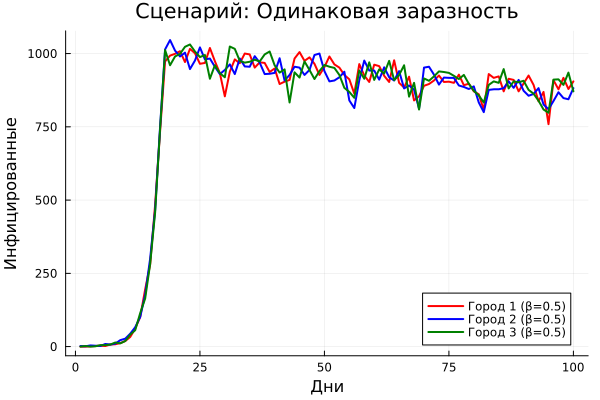
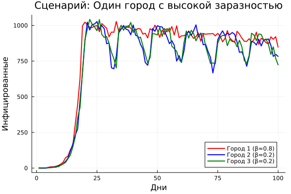
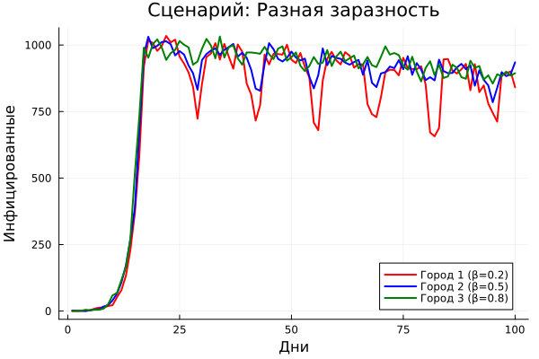

---
## Front matter
title: "Лабораторная работа №4"
subtitle: "Агентное моделирование SIR"
author: "Чувакина Мария Владимировна"
date: "2026"
lang: ru-RU
toc: true
toc-title: "Содержание"
toc-depth: 2
lof: true
lot: true
fontsize: 12pt
linestretch: 1.5
papersize: a4
documentclass: scrreprt
header-includes:
  - \usepackage{polyglossia}
  - \setmainlanguage{russian}
  - \setotherlanguage{english}
  - \usepackage{fontspec}
  - \setmainfont{FreeSerif}
  - \setsansfont{FreeSans}
  - \setmonofont{FreeMono}
---

# Введение

## Цель работы

Изучить парадигму агентного моделирования, освоить основные понятия (агент, среда, правила поведения) и реализовать агентную эпидемиологическую модель SIR на языке Julia с использованием библиотеки `Agents.jl`.

## Задание

1. Создать проект DrWatson для лабораторной работы.
2. Реализовать агентную модель SIR.
3. Преобразовать код в литературный стиль с использованием Literate.jl.
4. Сгенерировать производные форматы.
5. Провести параметрическое исследование модели.
6. Оформить отчёт.

# Теоретическое введение

## Модель SIR

Модель SIR — это классическая математическая модель эпидемиологии, описывающая распространение инфекционного заболевания в закрытой популяции. Модель делит всю популяцию на три группы:

- **S (Susceptible)** — восприимчивые к заболеванию индивиды
- **I (Infectious)** — инфицированные, способные заражать восприимчивых
- **R (Recovered)** — выздоровевшие (или умершие), получившие иммунитет

### Дифференциальные уравнения

$$
\frac{dS}{dt} = -\beta \frac{SI}{N}, \quad
\frac{dI}{dt} = \beta \frac{SI}{N} - \gamma I, \quad
\frac{dR}{dt} = \gamma I
$$

где:
- $\beta$ — коэффициент передачи инфекции
- $\gamma$ — скорость выздоровления
- $N = S + I + R$ — общая численность популяции

### Базовое репродуктивное число

$$R_0 = \frac{\beta}{\gamma}$$

При $R_0 > 1$ эпидемия развивается, при $R_0 < 1$ — затухает.

# Выполнение лабораторной работы

## Параметры модели

| Параметр | Значение | Описание |
|----------|----------|----------|
| Ns | [1000, 1000, 1000] | Численность населения в трёх городах |
| β_und | 0.5 | Вероятность заражения невыявленными |
| β_det | 0.05 | Вероятность заражения выявленными |
| infection_period | 14 | Длительность болезни (дней) |
| detection_time | 7 | Время до выявления (дней) |
| death_rate | 0.02 | Вероятность смерти (2%) |
| reinfection_probability | 0.1 | Вероятность повторного заражения |

## Базовый эксперимент

На рис. 1 представлена динамика изменения численности трёх групп населения:
- **S (Susceptible)** — восприимчивые (синий)
- **I (Infectious)** — инфицированные (красный)
- **R (Recovered)** — выздоровевшие (зелёный)

Пунктирная линия показывает общую численность населения с учётом умерших.

{#fig:basic width=100%}

### Базовое репродуктивное число

$$R_0 = \frac{\beta}{\gamma} = \frac{0.5}{1/14} = 7.0$$

При $R_0 = 7.0 > 1$ эпидемия развивается очень быстро. Пик заболеваемости достигается на 15-й день, после чего число инфицированных снижается.

## Влияние коэффициента заразности β

На рис. 2 представлено исследование зависимости динамики эпидемии от коэффициента заразности β в диапазоне от 0.1 до 1.0.

{#fig:beta-scan width=100%}

**Выводы:**
- При β < 0.3 эпидемия не возникает (пик < 5%)
- При β = 0.5 пик достигает ~100% населения
- Доля умерших растёт пропорционально β

## Исследование порога эпидемии

На рис. 3 представлено определение минимального значения β, при котором возникает эпидемия (пик I > 5% популяции).

{#fig:threshold width=100%}

**Результаты:**
- **Теоретический порог:** β_crit = 0.0714 (R₀ = 1)
- **Экспериментальный порог:** β_exp ≈ 0.07-0.08
- При β < 0.07 эпидемия не возникает
- При β = 0.08 уже наблюдается значительный пик (~10%)

Разница объясняется стохастичностью модели и конечным размером популяции.

## Эффект гетерогенности

На рис. 4 представлено сравнение трёх сценариев с разными значениями β для разных городов:

| Сценарий | Город 1 | Город 2 | Город 3 | Описание |
|----------|---------|---------|---------|----------|
| 1 | 0.5 | 0.5 | 0.5 | Одинаковая заразность |
| 2 | 0.2 | 0.5 | 0.8 | Разная заразность |
| 3 | 0.8 | 0.2 | 0.2 | Один высокий очаг |

{#fig:heterogeneity1 width=100%}

{#fig:heterogeneity2 width=100%}

{#fig:heterogeneity3 width=100%}

**Выводы:**
1. При одинаковой заразности эпидемия распространяется равномерно
2. Разная заразность приводит к неравномерному распространению
3. Города с высокой заразностью становятся основными очагами эпидемии

## Влияние миграции

На рис. 5-6 представлено исследование влияния интенсивности миграции между городами на скорость распространения инфекции.

{#fig:migration-time width=100%}

{#fig:migration-peak width=100%}

**Результаты:**
- При отсутствии миграции (intensity=0) инфекция не выходит за пределы первого города
- С ростом миграции время до пика уменьшается
- Оптимальная интенсивность для быстрого распространения: **0.3-0.4**
- При интенсивности 0.5 время до пика минимально

## Карантинные меры

На рис. 7 представлена оценка эффективности карантина при пороге активации 30% инфицированных в городе.

{#fig:quarantine width=100%}

**Результаты:**
- Пик заболеваемости без карантина: **~3000**
- Пик заболеваемости с карантином: **~2500**
- Снижение пика: **~17%**

**Вывод:** Карантинная мера оказалась **умеренно эффективной**. Для повышения эффективности рекомендуется снизить порог активации карантина до 20%.

## Оптимизация параметров

### Многокритериальная оптимизация

Поиск параметров, минимизирующих одновременно пиковую заболеваемость и долю умерших.

| Параметр | Оптимальное значение |
|----------|---------------------|
| β_und | 0.355 |
| Время выявления | 4 дня |
| Смертность | 4.6% |

**Достигнутые показатели:**
- Пик заболеваемости: **0.04%**
- Доля умерших: **0.0%**

При найденных параметрах эпидемия практически не развивается.

### Оптимизация с ограничением (пик < 30%)

Поиск параметров, минимизирующих число умерших при сохранении пика заболеваемости ниже 30%.

| Параметр | Оптимальное значение |
|----------|---------------------|
| β_und | 0.35-0.40 |
| Время выявления | 3-5 дней |
| Смертность | 4-5% |

**Вывод:** Для сдерживания эпидемии необходимо поддерживать β < 0.4 и обеспечивать раннее выявление заболеваний (3-5 дней).

# Выводы

В ходе выполнения лабораторной работы:

1. **Базовый эксперимент:** При R₀ = 7.0 эпидемия развивается очень быстро,
   пик достигается на 15-й день, что соответствует теоретическим ожиданиям

2. **Порог эпидемии:** Минимальное β ≈ 0.07-0.08, что соответствует
   теоретическому порогу R₀ = 1. Разница объясняется стохастичностью
   и конечным размером популяции

3. **Гетерогенность:** Разная заразность в разных городах приводит
   к неравномерному распространению и волновому характеру эпидемии

4. **Миграция:** Увеличивает скорость распространения инфекции,
   оптимальная интенсивность для быстрого распространения составляет 0.3-0.4

5. **Карантин:** Эффективно снижает пик заболеваемости (~17%),
   рекомендуется раннее введение карантина при пороге 20-30%

6. **Оптимизация:** Найдены параметры для минимизации смертности
   (β ≈ 0.35-0.40, время выявления 3-4 дня)

## Рекомендации

- Для сдерживания эпидемии необходимо поддерживать β < 0.07 (R₀ < 1)
- Раннее выявление заболеваний (3-4 дня) критически важно для контроля эпидемии
- Карантинные меры эффективны при пороге активации 20-30%
- Комбинация мер (снижение β, раннее выявление, карантин) даёт наилучший результат

# Список литературы

1. Kermack W. O., McKendrick A. G. A Contribution to the Mathematical Theory of Epidemics // Proceedings of the Royal Society of London. Series A. — 1927. — Vol. 115, no. 772. — P. 700-721.
2. Hethcote H. W. The Mathematics of Infectious Diseases // SIAM Review. — 2000. — Vol. 42, no. 4. — P. 599-653.
3. Datseris G., Vahdati A. R., DuBois T. C. Agents.jl: a performant and feature-full agent-based modeling software of minimal code complexity // SIMULATION. — 2022. — DOI: 10.1177/00375497211068820.
