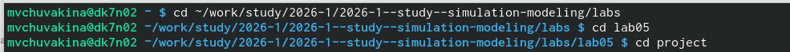
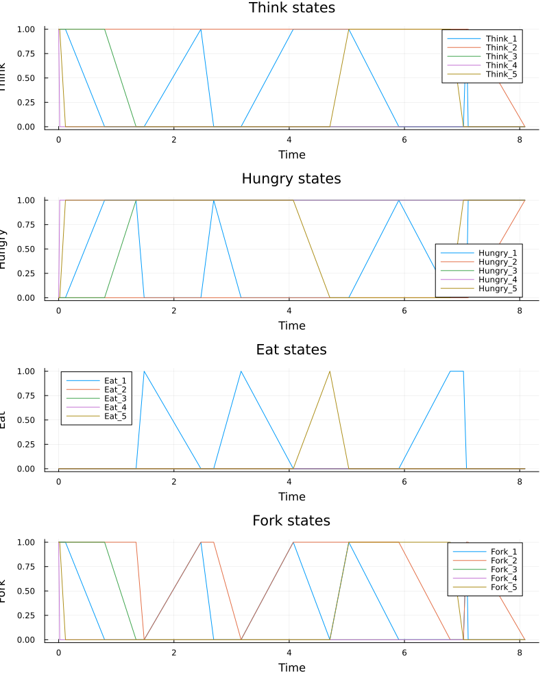
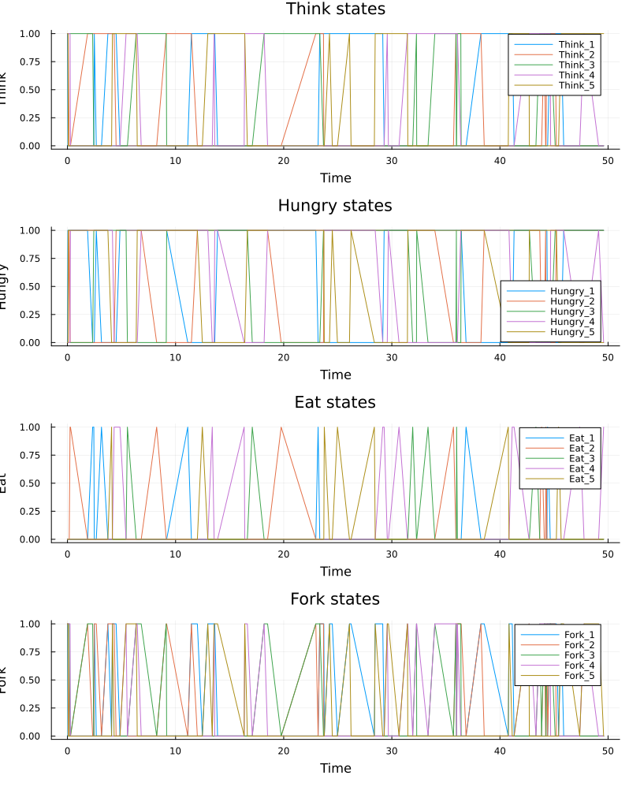
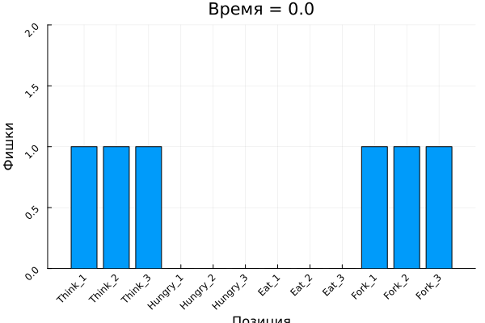
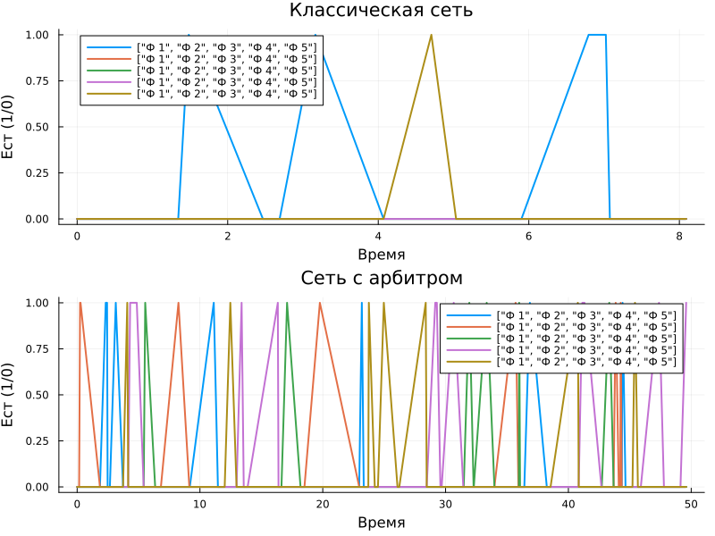
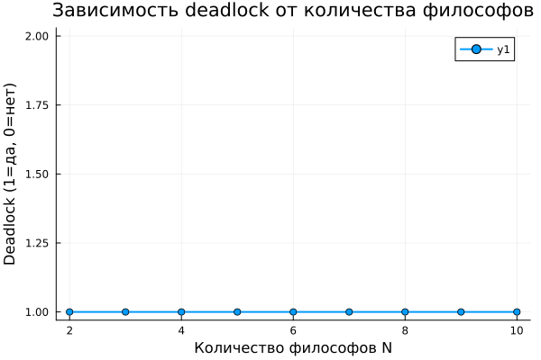
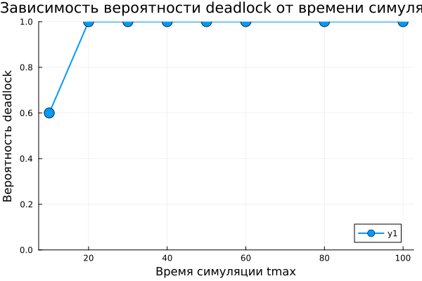

---
## Front matter
lang: ru-RU
title: Лабораторная работа №5
subtitle: "Аппарат сетей Петри:"
author:
  - Чувакина М. В.
institute:
  - Российский университет дружбы народов, Москва, Россия
date: 14 апреля 2026

## i18n babel
babel-lang: russian
babel-otherlangs: english

## Formatting pdf
toc: false
toc-title: Содержание
slide_level: 2
aspectratio: 169
section-titles: true
theme: metropolis
---

## Докладчик

:::::::::::::: {.columns align=center}
::: {.column width="70%"}

  * Чувакина Мария Владимировна
  * студентка
  * группа НКНбд-01-23
  * Российский университет дружбы народов
  * [1132236055@rudn.ru](mailto:1132236055@rudn.ru)
  * <https://github.com/mvchuvakina>

:::
::: {.column width="30%"}

:::
::::::::::::::

# 1. Цель работы

Изучить аппарат сетей Петри на примере классической задачи синхронизации
«Обедающие философы» (Dining Philosophers), исследовать проблему взаимной
блокировки (deadlock) и способы её предотвращения с использованием
стохастического моделирования в Julia.

---

# 2. Задание

1. Создать рабочий каталог для кода.
2. Установить необходимые пакеты.
3. Реализовать модуль для построения сетей Петри.
4. Построить классическую сеть Петри для задачи «Обедающие философы».
5. Построить модифицированную сеть с арбитром для предотвращения deadlock.
6. Провести стохастическое моделирование (алгоритм Гиллеспи) для обеих сетей.
7. Выполнить анимацию процесса для наглядной демонстрации.
8. Преобразовать код в литературный стиль.
9. Сгенерировать производные форматы.
10. Интегрировать документацию в формате Quarto в отчёт.

---

# 3. Этапы выполнения

### 3.1. Подготовка рабочего пространства

- Создан каталог `labs/lab05_petri`

{#fig:001 width=70%}

# 3. Этапы выполнения

### 3.1. Подготовка рабочего пространства

- Создан проект DrWatson в `labs/lab05_petri/project`

{#fig:002 width=70%}

# 3. Этапы выполнения

### 3.1. Подготовка рабочего пространства

- Установлены необходимые пакеты: `OrdinaryDiffEq.jl`, `Plots.jl`, `DataFrames.jl`,
  `CSV.jl`, `Random.jl`, `LinearAlgebra.jl`, `Literate.jl`, `DrWatson` и др.

{#fig:003 width=70%}

- Проверена установка пакетов

# 3. Этапы выполнения

### 3.2. Реализация модуля DiningPhilosophers.jl

Создан файл `src/DiningPhilosophers.jl` с определением:
- Структуры `PetriNet`
- Функции `build_classical_network(N)`
- Функции `build_arbiter_network(N)`
- Функции `simulate_stochastic` (алгоритм Гиллеспи)
- Функции `detect_deadlock`
- Функции `plot_marking_evolution`

# 3. Этапы выполнения
 
### 3.3. Базовые скрипты

Созданы и запущены скрипты:

`dining_philosophers.jl` - Базовый эксперимент 
`dining_philosophers_animation.jl` - Анимация процесса 
`dining_philosophers_report.jl` - Итоговый отчёт 

# 3. Этапы выполнения

### 3.4. Параметрические исследования

- **Влияние количества философов N** (N = 2..10)
- **Влияние времени симуляции tmax** (10, 20, 30, 40, 50, 60, 80, 100)

# 3. Этапы выполнения

### 3.5. Литературное программирование

Созданы литературные версии всех скриптов (`*_literate.jl`) с подробными Markdown-комментариями.

С помощью `scripts/tangle.jl` сгенерированы:
- Чистый код в папку `scripts/`
- Jupyter notebooks в папку `notebooks/`
- Quarto-документы в папку `markdown/`

# 3. Этапы выполнения

#### 3.5.1. Генерация производных форматов

Сгенерированы производные форматы для всех литературных скриптов

{#fig:005 width=70%}

# 3. Этапы выполнения

### 3.6. Создание отчёта

- Создан файл `report.qmd` в папке `report/`
- Добавлены все графики с подписями
- Скомпилированы report.pdf и report.docx

{#fig:006 width=70%}

### 3.7. Отправка на GitVerse и GitHub

- Все изменения добавлены в Git
- Создан коммит: `feat(lab05): полное выполнение лабораторной работы №5`
- Изменения отправлены на GitVerse и GitHub

# 4. Полученные результаты

### 4.1. Классическая сеть (без арбитра)

{#fig:classic width=100%}

# 4. Полученные результаты

### 4.2. Сеть с арбитром

{#fig:arbiter width=100%}

# 4. Полученные результаты

### 4.3. Анимация процесса

{#fig:animation width=100%}

Анимация наглядно показывает перемещение фишек между позициями.

# 4. Полученные результаты

### 4.4. Сравнительный анализ

{#fig:comparison width=100%}

**Результаты:**
- Классическая сеть: все Eat_i падают до нуля (deadlock)
- Сеть с арбитром: Eat_i колеблются, deadlock отсутствует

# 4. Полученные результаты

### 4.5. Параметрическое исследование

#### Влияние количества философов N

{#fig:param_N width=100%}

**Вывод:** При N = 1 deadlock невозможен, при N ≥ 2 возникает с вероятностью 1.

# 4. Полученные результаты

### 4.5. Параметрическое исследование

#### Влияние времени симуляции tmax

{#fig:param_tmax width=100%}

**Вывод:** С увеличением tmax вероятность deadlock стремится к 1. При tmax = 50 вероятность достигает 100%.

# 5. Выводы

В ходе выполнения лабораторной работы:

- Изучен аппарат сетей Петри — математический инструмент для моделирования
  дискретных систем.

- Реализован модуль `DiningPhilosophers.jl` для построения и анализа сетей Петри.

- Построена классическая сеть Петри для задачи «Обедающие философы»,
  демонстрирующая проблему взаимной блокировки (deadlock).

- Построена модифицированная сеть с арбитром, предотвращающая deadlock.

# 5. Выводы

- Проведено стохастическое моделирование (алгоритм Гиллеспи) для обеих сетей.

- Выполнена анимация процесса, наглядно показывающая перемещение фишек.

- Проведены параметрические исследования:
  - Влияние количества философов N на deadlock
  - Влияние времени симуляции tmax на вероятность deadlock

- Освоено литературное программирование с использованием Literate.jl.

# 5. Выводы

- Сгенерированы производные форматы: чистый код, Jupyter notebooks,
  Quarto-документы.

- Подготовлен отчёт в форматах PDF и DOCX.

- Результаты отправлены на GitVerse.

Работа позволила на практике освоить аппарат сетей Петри для моделирования
параллельных процессов и закрепить навыки работы с языком Julia.
