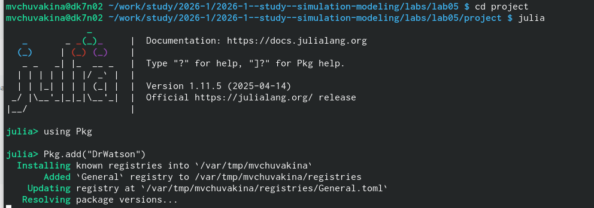
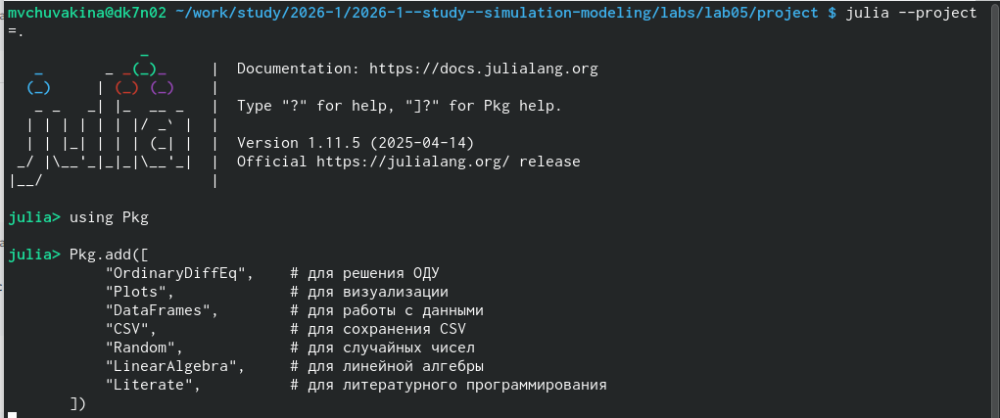
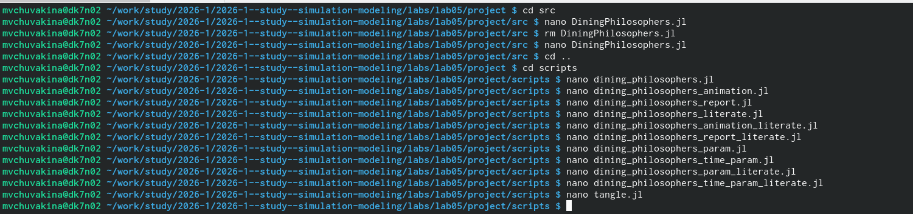
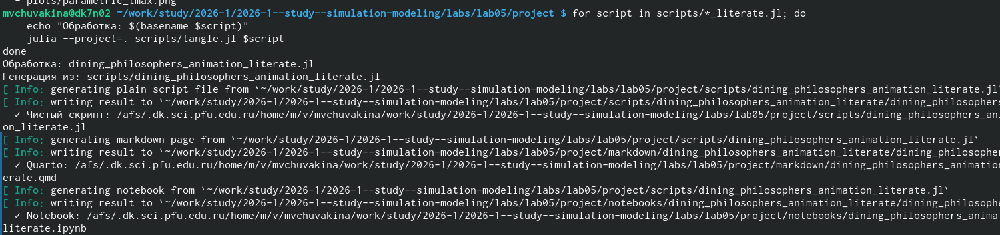

---
## Front matter
title: "Лабораторная работа №5"
subtitle: "Аппарат сетей Петри"
author: "Чувакина Мария Владимировна"
date: "2026"
lang: ru-RU
toc: true
toc-title: "Содержание"
toc-depth: 2
lof: true
lot: true
fontsize: 12pt
linestretch: 1.5
papersize: a4
documentclass: scrreprt
header-includes:
  - \usepackage{polyglossia}
  - \setmainlanguage{russian}
  - \setotherlanguage{english}
  - \usepackage{fontspec}
  - \setmainfont{FreeSerif}
  - \setsansfont{FreeSans}
  - \setmonofont{FreeMono}
---

## 1. Цель работы

Изучить аппарат сетей Петри на примере классической задачи синхронизации
«Обедающие философы» (Dining Philosophers), исследовать проблему взаимной
блокировки (deadlock) и способы её предотвращения с использованием
стохастического моделирования в Julia.

---

## 2. Задание

1. Создать рабочий каталог для кода.
2. Установить необходимые пакеты.
3. Реализовать модуль для построения сетей Петри.
4. Построить классическую сеть Петри для задачи «Обедающие философы».
5. Построить модифицированную сеть с арбитром для предотвращения deadlock.
6. Провести стохастическое моделирование (алгоритм Гиллеспи) для обеих сетей.
7. Выполнить анимацию процесса для наглядной демонстрации.
8. Преобразовать код в литературный стиль.
9. Сгенерировать производные форматы (чистый код, Jupyter notebooks, Quarto).
10. Интегрировать документацию в формате Quarto в отчёт.

---

## 3. Этапы выполнения

### 3.1. Подготовка рабочего пространства

- Создан каталог `labs/lab05_petri`

{#fig:001 width=70%}

- Создан проект DrWatson в `labs/lab05_petri/project`

{#fig:002 width=70%}

- Установлены необходимые пакеты: `OrdinaryDiffEq.jl`, `Plots.jl`, `DataFrames.jl`,
  `CSV.jl`, `Random.jl`, `LinearAlgebra.jl`, `Literate.jl`, `DrWatson` и др.

{#fig:003 width=70%}

- Проверена установка пакетов

### 3.2. Реализация модуля DiningPhilosophers.jl

Создан файл `src/DiningPhilosophers.jl` с определением:

- **Структуры `PetriNet`** — для хранения сети Петри (позиции, переходы, матрица инцидентности)
- **Функции `build_classical_network(N)`** — построение классической сети Петри для N философов
- **Функции `build_arbiter_network(N)`** — построение сети с арбитром (дополнительная позиция с N-1 фишками)
- **Функции `simulate_stochastic`** — стохастическое моделирование (алгоритм Гиллеспи)
- **Функции `detect_deadlock`** — обнаружение взаимной блокировки
- **Функции `plot_marking_evolution`** — визуализация эволюции маркировки

### 3.3. Базовые скрипты

Созданы и запущены следующие скрипты:

| Файл | Назначение | Результат |
|------|------------|-----------|
| `dining_philosophers.jl` | Базовый эксперимент | `classic_simulation.png`, `arbiter_simulation.png` |
| `dining_philosophers_animation.jl` | Анимация процесса | `philosophers_simulation.gif` |
| `dining_philosophers_report.jl` | Итоговый отчёт | `final_report.png` |

{#fig:004 width=70%}

### 3.4. Параметрические исследования

#### Влияние количества философов N

Исследовано влияние количества философов N на возникновение deadlock.
Значения N: от 2 до 10.

{#fig:param_N width=100%}

#### Влияние времени симуляции tmax

Исследовано влияние времени симуляции tmax на вероятность обнаружения deadlock.
Значения tmax: 10, 20, 30, 40, 50, 60, 80, 100.

{#fig:param_tmax width=100%}

### 3.5. Литературное программирование

Созданы литературные версии всех скриптов (`*_literate.jl`) с подробными
Markdown-комментариями:

- `dining_philosophers_literate.jl`
- `dining_philosophers_animation_literate.jl`
- `dining_philosophers_report_literate.jl`
- `dining_philosophers_param_literate.jl`
- `dining_philosophers_time_param_literate.jl`

С помощью `scripts/tangle.jl` сгенерированы:
- Чистый код в папку `scripts/` (подпапки для каждого скрипта)
- Jupyter notebooks в папку `notebooks/`
- Quarto-документы в папку `markdown/`

{#fig:005 width=70%}

### 3.6. Создание отчёта

- Создан файл `report.qmd` в папке `report/`
- Добавлены все графики с подписями
- Скомпилированы report.pdf и report.docx

### 3.7. Отправка на GitVerse и GitHub

- Все изменения добавлены в Git
- Создан коммит: `feat(lab05): полное выполнение лабораторной работы №5`
- Изменения отправлены на GitVerse и GitHub

## 4. Полученные результаты

### 4.1. Классическая сеть Петри (без арбитра)

На рисунке 1 представлена эволюция маркировки классической сети Петри
для 5 философов. Четыре панели показывают динамику состояний:
- **Think** — философы думают
- **Hungry** — философы голодны (хотят есть)
- **Eat** — философы едят
- **Fork** — состояние вилок (1 — вилка свободна, 0 — занята)

{#fig:classic width=100%}

**Анализ:** В классической сети через некоторое время все философы
оказываются в состоянии Hungry, ни один не может есть — наступает deadlock.

### 4.2. Сеть с арбитром

На рисунке 2 представлена эволюция маркировки сети Петри с арбитром.
Арбитр — дополнительная позиция с N-1 фишками, которая ограничивает
количество одновременно eat философов до N-1.

{#fig:arbiter width=100%}

**Анализ:** Сеть с арбитром предотвращает deadlock — состояния Eat_i
колеблются, всегда есть хотя бы один философ, который ест.

### 4.3. Анимация процесса

На рисунке 3 представлена анимация работы сети Петри для 3 философов.
Анимация наглядно показывает перемещение фишек между позициями.

{#fig:animation width=100%}

### 4.4. Сравнительный анализ

На рисунке 4 представлен сравнительный график числа философов в состоянии
«Ест» (Eat_i) для классической сети и сети с арбитром.

{#fig:comparison width=100%}

**Результаты:**
- Классическая сеть: через некоторое время все Eat_i падают до нуля (deadlock)
- Сеть с арбитром: Eat_i колеблются, всегда есть хотя бы один eat философ

### 4.5. Параметрическое исследование

#### Влияние количества философов N

На рисунке 5 представлена зависимость deadlock от количества философов N.

{#fig:param_N width=100%}

**Вывод:** При N = 1 deadlock невозможен (философ ест в одиночестве).
При N ≥ 2 deadlock возникает с вероятностью 1.

#### Влияние времени симуляции tmax

На рисунке 6 представлена зависимость вероятности deadlock от времени
симуляции tmax.

{#fig:param_tmax width=100%}

**Вывод:** С увеличением времени симуляции вероятность обнаружения
deadlock стремится к 1. При tmax = 50 вероятность достигает 100%.

## 5. Выводы

В ходе выполнения лабораторной работы:

- Изучен аппарат сетей Петри — математический инструмент для моделирования
  дискретных систем, состоящий из позиций, переходов, дуг и фишек.

- Реализован модуль `DiningPhilosophers.jl` для построения и анализа сетей Петри.

- Построена классическая сеть Петри для задачи «Обедающие философы»,
  демонстрирующая проблему взаимной блокировки (deadlock).

- Построена модифицированная сеть с арбитром, предотвращающая deadlock.

- Проведено стохастическое моделирование (алгоритм Гиллеспи) для обеих сетей.

- Выполнена анимация процесса, наглядно показывающая перемещение фишек.

- Проведены параметрические исследования:
  - Влияние количества философов N на deadlock
  - Влияние времени симуляции tmax на вероятность deadlock

- Освоено литературное программирование с использованием Literate.jl —
  созданы скрипты, объединяющие код и документацию.

- Сгенерированы производные форматы: чистый код, Jupyter notebooks,
  Quarto-документы.

- Подготовлен отчёт в форматах PDF и DOCX.

- Результаты отправлены на GitVerse.

Работа позволила на практике освоить аппарат сетей Петри для моделирования
параллельных процессов и закрепить навыки работы с языком Julia.

# 6. Список литературы

1. Питерсон Дж. Теория сетей Петри и моделирование систем. — М.: Мир, 1984. — 264 с.

2. Документация пакета OrdinaryDiffEq.jl для Julia:
   https://docs.sciml.ai/DiffEqDocs/stable/

3. Документация пакета Plots.jl для Julia:
   https://docs.juliaplots.org/stable/

4. Документация пакета Literate.jl для Julia:
   https://github.com/fredrikekre/Literate.jl

5. Документация пакета DrWatson.jl для Julia:
   https://juliadynamics.github.io/DrWatson.jl/
