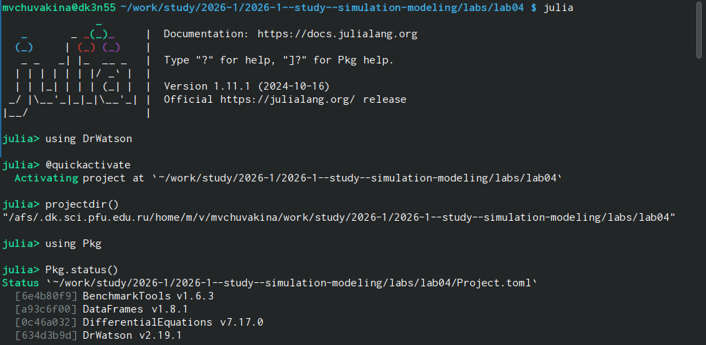
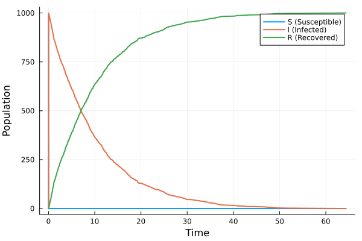
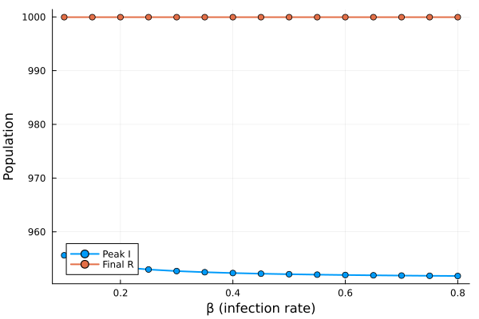
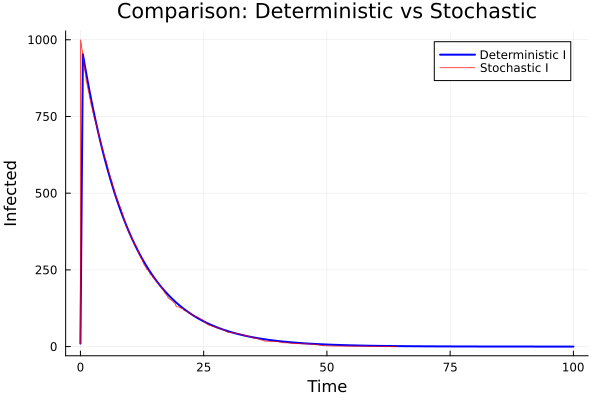
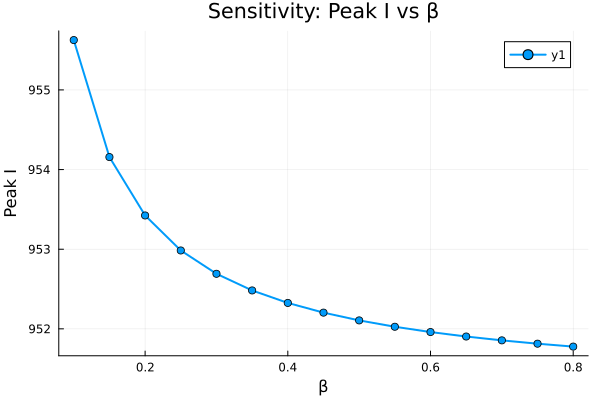
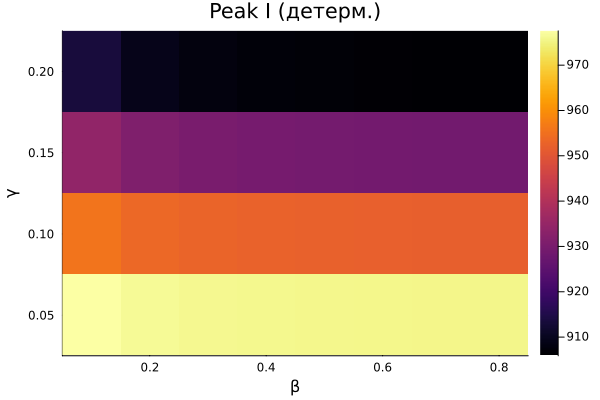
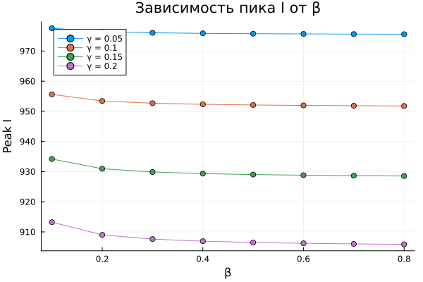
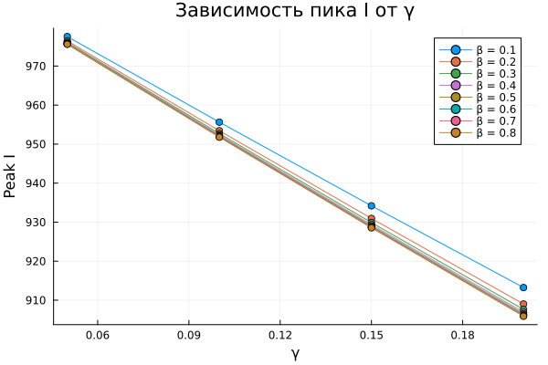
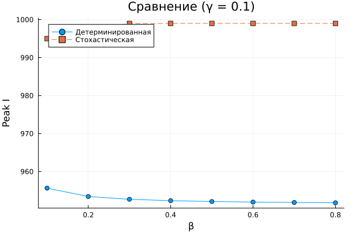
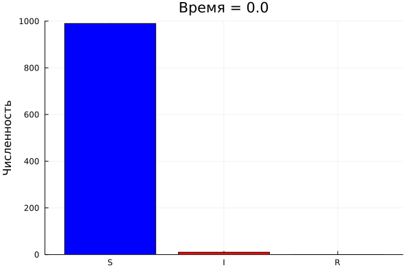

---
## Front matter
lang: ru-RU
title: Лабораторная работа №6
subtitle: "Реализация модели SIR в подходе сетей Петри"
author:
  - Чувакина М. В.
institute:
  - Российский университет дружбы народов, Москва, Россия
date: 28 апреля 2026

## i18n babel
babel-lang: russian
babel-otherlangs: english

## Formatting pdf
toc: false
toc-title: Содержание
slide_level: 2
aspectratio: 169
section-titles: true
theme: metropolis

---

## Докладчик

:::::::::::::: {.columns align=center}
::: {.column width="70%"}

  * Чувакина Мария Владимировна
  * студентка
  * группа НКНбд-01-23
  * Российский университет дружбы народов
  * [1132236055@rudn.ru](mailto:1132236055@rudn.ru)
  * <https://github.com/mvchuvakina>

:::
::: {.column width="30%"}

:::
::::::::::::::

# 1. Цель работы

Реализовать эпидемиологическую модель SIR с использованием аппарата сетей Петри,
выполнить детерминированное и стохастическое моделирование.

---

# 2. Задание

1. Создать рабочий каталог для кода.
2. Установить необходимые пакеты.
3. Реализовать модуль для построения сетей Петри модели SIR.
4. Построить сеть Петри для модели SIR.
5. Провести детерминированное моделирование (решение ОДУ).
6. Провести стохастическое моделирование (алгоритм Гиллеспи).
7. Выполнить сканирование параметра β.
8. Создать анимацию динамики эпидемии.
9. Выполнить параметрическое исследование (β, γ).
10. Преобразовать код в литературный стиль.
11. Сгенерировать производные форматы.

---

# 3. Этапы выполнения

### 3.1. Подготовка рабочего пространства

- Создан каталог `labs/lab06`

{#fig:001 width=70%}

# 3. Этапы выполнения

### 3.1. Подготовка рабочего пространства

- Создан проект DrWatson в `labs/lab06/project`

{#fig:002 width=70%}

# 3. Этапы выполнения

### 3.1. Подготовка рабочего пространства

- Установлены необходимые пакеты: `OrdinaryDiffEq.jl`, `Plots.jl`, `DataFrames.jl`,
  `CSV.jl`, `Random.jl`, `LinearAlgebra.jl`, `Literate.jl`, `DrWatson` и др.

- Проверена установка пакетов

# 3. Этапы выполнения

### 3.2. Реализация модуля SIRPetri.jl

Создан файл `src/SIRPetri.jl` с определением:
- Структуры `PetriNet`
- Функции `build_sir_network(β, γ)`
- Функции `simulate_deterministic` (решение ОДУ)
- Функции `simulate_stochastic` (алгоритм Гиллеспи)
- Функции `plot_sir` для визуализации

# 3. Этапы выполнения
 
### 3.3. Базовые скрипты

Созданы и запущены скрипты:

`dining_philosophers.jl` - Базовый эксперимент 
`dining_philosophers_animation.jl` - Анимация процесса 
`dining_philosophers_report.jl` - Итоговый отчёт 

# 3. Этапы выполнения

### 3.4. Параметрические исследования

- **Влияние параметра β** (β = 0.1..0.8, γ = 0.1 фиксирован)
- **Влияние параметров β и γ** (β = 0.1..0.8, γ = 0.05..0.2)

# 3. Этапы выполнения

### 3.5. Литературное программирование

Созданы литературные версии всех скриптов (`*_literate.jl`) с подробными Markdown-комментариями.

С помощью `scripts/tangle.jl` сгенерированы:
- Чистый код в папку `scripts/`
- Jupyter notebooks в папку `notebooks/`
- Quarto-документы в папку `markdown/`

# 3. Этапы выполнения

#### 3.5.1. Генерация производных форматов

Сгенерированы производные форматы для всех литературных скриптов

# 3. Этапы выполнения

### 3.6. Создание отчёта

- Создан файл `report.qmd` в папке `report/`
- Добавлены все графики с подписями
- Скомпилированы report.pdf и report.docx

### 3.7. Отправка на GitVerse и GitHub

- Все изменения добавлены в Git
- Создан коммит: `feat(lab06): реализация модели SIR на сетях Петри`
- Изменения отправлены на GitVerse и GitHub

# 4. Полученные результаты

### 4.1. Базовый эксперимент

#### Детерминированная динамика

{#fig:det width=100%}

#### Стохастическая динамика

{#fig:stoch width=100%}

# 4. Полученные результаты

### 4.2. Сканирование параметра β

{#fig:scan width=100%}

**Анализ:** При малых β эпидемия не возникает. С ростом β пик заболеваемости резко возрастает.

# 4. Полученные результаты

### 4.3. Сравнение детерм. и стохаст. динамики

{#fig:comparison width=100%}

**Анализ:** Стохастическая кривая имеет флуктуации, но качественно совпадает с детерминированной.

# 4. Полученные результаты

### 4.4. Чувствительность к параметру β

{#fig:sensitivity width=100%}

**Анализ:** Зависимость peak I(β) имеет пороговый характер.

# 4. Полученные результаты

### 4.5. Параметрическое исследование

#### Тепловая карта пика I

{#fig:heatmap width=100%}

#### Зависимость пика I от β

{#fig:beta_dep width=100%}

# 4. Полученные результаты

### 4.5. Параметрическое исследование

#### Зависимость пика I от γ

{#fig:gamma_dep width=100%}

#### Сравнение детерм. и стохаст.

{#fig:method_comp width=100%}

# 4. Полученные результаты

### 4.6. Анимация динамики

{#fig:animation width=100%}

Анимация наглядно показывает:
- Рост числа инфицированных в начале эпидемии
- Пик заболеваемости
- Последующее снижение I и рост R

# 5. Выводы

В ходе выполнения лабораторной работы:

- Реализована модель SIR на сетях Петри.

- Проведено детерминированное (решение ОДУ) и стохастическое (алгоритм
  Гиллеспи) моделирование.

- Выполнено сканирование параметра β для анализа порогового явления.

- Создана анимация динамики эпидемии.

# 5. Выводы

- Проведено параметрическое исследование влияния β и γ на динамику.

- Освоено литературное программирование с использованием Literate.jl.

- Сгенерированы производные форматы: чистый код, Jupyter notebooks,
  Quarto-документы.

- Подготовлен отчёт в форматах PDF и DOCX.

- Результаты отправлены на GitVerse.

Работа позволила на практике освоить аппарат сетей Петри для моделирования
эпидемиологических процессов и закрепить навыки работы с языком Julia
