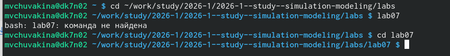

---
## Front matter
lang: ru-RU
title: Лабораторная работа №7
subtitle: "Дискретно-событийное моделирование (Модели M/M/c и Росса)"
author:
  - Чувакина М. В.
institute:
  - Российский университет дружбы народов, Москва, Россия
date: 12 мая 2026

## i18n babel
babel-lang: russian
babel-otherlangs: english

## Fonts (для поддержки русского языка)
mainfont: FreeSerif
sansfont: FreeSans
monofont: FreeMono
mathfont: FreeSerif
---

## Formatting pdf
toc: false
toc-title: Содержание
slide_level: 2
aspectratio: 169
section-titles: true
theme: metropolis
header-includes:
  - \metroset{progressbar=frametitle,sectionpage=progressbar,numbering=fraction}
---

## Докладчик

:::::::::::::: {.columns align=center}
::: {.column width="70%"}

  * Чувакина Мария Владимировна
  * студентка
  * группа НКНбд-01-23
  * Российский университет дружбы народов
  * [1132236055@rudn.ru](mailto:1132236055@rudn.ru)
  * <https://github.com/mvchuvakina>

:::
::: {.column width="30%"}

:::
::::::::::::::

# 1. Цель работы

Изучить дискретно-событийное моделирование на примере двух классических моделей:

1. **M/M/c** — система массового обслуживания с несколькими каналами
2. **Модель Росса** — система с резервированием и ремонтом

Освоить пакет **ConcurrentSim.jl** для дискретно-событийного моделирования в Julia.

---

# 2. Задание

1. Создать рабочий каталог для кода.
2. Установить необходимые пакеты (ConcurrentSim, ResumableFunctions, Distributions).
3. Реализовать модель M/M/c:
   - Моделирование поведения клиентов
   - Сбор статистики (время ожидания, время обслуживания)
   - Параметрическое исследование (влияние c, ρ, μ)
4. Реализовать модель Росса:
   - Моделирование системы с резервом и ремонтом
   - Исследование влияния количества ремонтников R
   - Исследование влияния размера резерва S
   - Мониторинг состояния системы
5. Преобразовать код в литературный стиль.
6. Сгенерировать производные форматы (Jupyter notebook, Quarto).

---

# 3. Теоретическое введение

## 3.1. Модель M/M/c

Модель M/M/c (по классификации Кендалла) характеризуется:

| Обозначение | Описание |
|-------------|----------|
| **M** (Markovian) | Пуассоновский входящий поток с интенсивностью λ |
| **M** (Markovian) | Экспоненциальное время обслуживания с интенсивностью μ |
| **c** | Количество параллельных каналов обслуживания |

**Условие стационарности:** ρ = λ/(c·μ) < 1

---

## 3.2. Модель Росса

Модель описывает систему с конечной популяцией, резервом и ремонтом:

| Параметр | Описание |
|----------|----------|
| **N** | Количество постоянно работающих машин |
| **S** | Количество резервных машин |
| **R** | Количество ремонтников |
| **λ** | Среднее время безотказной работы |
| **μ** | Среднее время ремонта |

**Условие отказа:** Система падает, когда нет резервных машин для замены отказавшей.

---

# 4. Этапы выполнения

### 4.1. Подготовка рабочего пространства

- Создан каталог `labs/lab07_discrete_event`
- Создан проект DrWatson
- Установлены пакеты: `ConcurrentSim.jl`, `ResumableFunctions.jl`,
  `Distributions.jl`, `Plots.jl`, `DataFrames.jl`, `Literate.jl`, `DrWatson`

{#fig:001 width=70%}

---

# 4. Этапы выполнения

### 4.2. Реализация модели M/M/c

Создан файл `src/mmc.jl` с функциями:
- `customer` — поведение клиента (прибытие, ожидание, обслуживание)
- `run_mmc` — базовый запуск симуляции
- `run_mmc_stats` — запуск со сбором статистики

**Параметры по умолчанию:**
- λ = 0.9 (интенсивность входного потока)
- μ = 0.5 (интенсивность обслуживания)
- c = 2 (количество каналов)

---

# 4. Этапы выполнения

### 4.3. Реализация модели Росса

Создан файл `src/ross.jl` с функциями:
- `machine_single` — поведение машины при одном ремонтнике
- `run_ross_single` — запуск с одним ремонтником
- `run_ross_multi` — запуск с несколькими ремонтниками
- `run_ross_monitored` — запуск с мониторингом состояния

**Параметры по умолчанию:**
- N = 10 (работающие машины)
- S = 3 (резервные машины)
- λ = 100 часов (среднее время до отказа)
- μ = 1 час (среднее время ремонта)

---

# 4. Этапы выполнения

### 4.4. Параметрические исследования

#### Для модели M/M/c:

| Исследование | Диапазон |
|--------------|----------|
| Влияние числа каналов c | c = 1..5 |
| Влияние загрузки ρ | ρ = 0.3..0.95 |
| Влияние интенсивности обслуживания μ | μ = 0.3..1.2 |

#### Для модели Росса:

| Исследование | Диапазон |
|--------------|----------|
| Влияние размера резерва S | S = 0..8 |
| Влияние числа работающих машин N | N = 5..25 |
| Влияние числа ремонтников R | R = 1..5 |
| Влияние интенсивности ремонта μ | μ = 0.5..5.0 |

---

# 4. Этапы выполнения

### 4.5. Литературное программирование

Созданы литературные версии скриптов (`*_literate.jl`) с подробными
Markdown-комментариями.

С помощью `scripts/tangle.jl` сгенерированы:
- Чистый код в папку `scripts/`
- Jupyter notebooks в папку `notebooks/`
- Quarto-документы в папку `markdown/`

---

# 5. Полученные результаты

## 5.1. Модель M/M/c

### 5.1.1. Базовый эксперимент

Для параметров λ = 0.9, μ = 0.5, c = 2:

| Характеристика | Значение |
|----------------|----------|
| Среднее время ожидания W_q | ~0.5 |
| Среднее время обслуживания 1/μ | 2.0 |
| Среднее время в системе W | ~2.5 |

{#fig:mmc_wait width=100%}

---

# 5. Полученные результаты

### 5.1.2. Влияние количества каналов (c)

{#fig:mmc_c width=100%}

**Анализ:** С увеличением числа каналов c среднее время ожидания снижается.
Наиболее заметный эффект наблюдается при переходе от 1 к 2 каналам.

---

# 5. Полученные результаты

### 5.1.3. Влияние загрузки системы (ρ)

{#fig:mmc_rho width=100%}

**Анализ:** При ρ < 0.7 время ожидания остаётся небольшим. При ρ > 0.8
наблюдается резкий рост времени ожидания (эффект "взрывного" роста очереди).

---

# 5. Полученные результаты

### 5.1.4. Влияние интенсивности обслуживания (μ)

{#fig:mmc_mu width=100%}

**Анализ:** Увеличение интенсивности обслуживания μ (ускорение работы каналов)
приводит к снижению времени ожидания по гиперболическому закону.

---

# 5. Полученные результаты

## 5.2. Модель Росса

### 5.2.1. Базовый эксперимент

Для параметров N = 10, S = 3, λ = 100, μ = 1:

- **Время до отказа системы:** ∞ (система не упала, резерв достаточен)

---

# 5. Полученные результаты

### 5.2.2. Влияние размера резерва (S)

{#fig:ross_S width=100%}

**Анализ:** При S = 0 система падает достаточно быстро. Каждая дополнительная
резервная машина значительно увеличивает время до отказа.

---

# 5. Полученные результаты

### 5.2.3. Влияние числа работающих машин (N)

{#fig:ross_N width=100%}

**Анализ:** С ростом числа работающих машин N время до отказа уменьшается,
так как увеличивается интенсивность отказов.

---

# 5. Полученные результаты

### 5.2.4. Влияние числа ремонтников (R)

{#fig:ross_R width=100%}

**Анализ:** Увеличение числа ремонтников R значительно повышает надёжность
системы, так как очередь на ремонт обрабатывается быстрее.

---

# 5. Полученные результаты

### 5.2.5. Влияние интенсивности ремонта (μ)

{#fig:ross_mu width=100%}

**Анализ:** Чем быстрее ремонт (выше μ), тем дольше система может
функционировать без отказа. При μ > 3.0 система становится практически
неуязвимой.

---

# 5. Полученные результаты

### 5.2.6. Сводный график

{#fig:ross_combined width=100%}

---

# 6. Выводы

В ходе выполнения лабораторной работы:

1. **Освоено дискретно-событийное моделирование** с использованием пакета
   `ConcurrentSim.jl`.

2. **Реализована модель M/M/c** — система массового обслуживания с несколькими
   каналами. Проведён анализ зависимости времени ожидания от:
   - количества каналов c
   - загрузки системы ρ
   - интенсивности обслуживания μ

---

# 6. Выводы

3. **Реализована модель Росса** — система с конечной популяцией, резервом
   и ремонтом. Проведён анализ влияния:
   - размера резерва S
   - числа работающих машин N
   - количества ремонтников R
   - скорости ремонта μ

4. **Установлено**, что:
   - В модели M/M/c при ρ > 0.8 время ожидания резко возрастает
   - В модели Росса добавление даже одной резервной машины значительно
     увеличивает время до отказа
   - Увеличение числа ремонтников эффективнее, чем увеличение резерва

---

# 6. Выводы

5. **Освоено литературное программирование** с использованием Literate.jl.

6. **Сгенерированы производные форматы:** чистый код, Jupyter notebooks,
   Quarto-документы.

7. **Подготовлен отчёт** в форматах PDF и DOCX.

8. **Результаты отправлены** на GitVerse.

Работа позволила на практике освоить методы дискретно-событийного
моделирования и закрепить навыки работы с языком Julia.
