---
## Front matter
title: "Лабораторная работа №7"
subtitle: "Дискретно-событийное моделирование (Модели M/M/c и Росса)"
author: "Чувакина Мария Владимировна"
date: "2026"
lang: ru-RU
toc: true
toc-title: "Содержание"
toc-depth: 2
lof: true
lot: true
fontsize: 12pt
linestretch: 1.5
papersize: a4
documentclass: scrreprt
header-includes:
  - \usepackage{polyglossia}
  - \setmainlanguage{russian}
  - \setotherlanguage{english}
  - \usepackage{fontspec}
  - \setmainfont{FreeSerif}
  - \setsansfont{FreeSans}
  - \setmonofont{FreeMono}
---

# 1. Цель работы

Изучить дискретно-событийное моделирование на примере двух классических моделей:
системы массового обслуживания M/M/c и модели Росса (система с резервированием
и ремонтом). Освоить пакет ConcurrentSim.jl для дискретно-событийного
моделирования в Julia.

---

# 2. Задание

1. Создать рабочий каталог для кода.
2. Установить необходимые пакеты (ConcurrentSim, ResumableFunctions, Distributions).
3. Реализовать модель M/M/c:
   - Моделирование поведения клиентов
   - Сбор статистики (время ожидания, время обслуживания)
   - Параметрическое исследование (влияние c, ρ, μ)
4. Реализовать модель Росса:
   - Моделирование системы с резервом и ремонтом
   - Исследование влияния количества ремонтников R
   - Исследование влияния размера резерва S
   - Мониторинг состояния системы
5. Преобразовать код в литературный стиль.
6. Сгенерировать производные форматы (Jupyter notebook, Quarto).

---

# 3. Этапы выполнения

### 3.1. Подготовка рабочего пространства

- Создан каталог `labs/lab07`

{#fig:001 width=70%}

- Создан проект DrWatson в `labs/lab07`

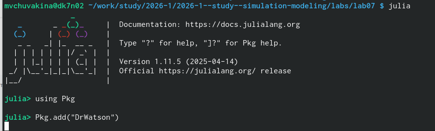{#fig:002 width=70%}

- Установлены необходимые пакеты: `ConcurrentSim.jl`, `ResumableFunctions.jl`,
  `Distributions.jl`, `Plots.jl`, `DataFrames.jl`, `Literate.jl`, `DrWatson` и др.

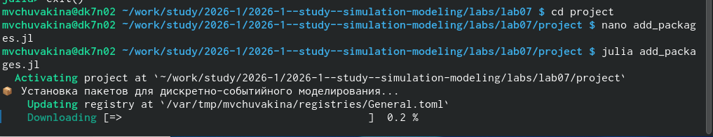{#fig:003 width=70%}

- Проверена установка пакетов

---

### 3.2. Реализация модели M/M/c

Создан файл `src/mmc.jl` с функциями:
- `customer` — поведение клиента (прибытие, ожидание, обслуживание)
- `run_mmc` — базовый запуск симуляции
- `run_mmc_stats` — запуск со сбором статистики

**Параметры модели M/M/c:**

| Параметр | Обозначение | Значение по умолчанию |
|----------|-------------|----------------------|
| Интенсивность входного потока | λ | 0.9 |
| Интенсивность обслуживания | μ | 0.5 |
| Количество каналов | c | 2 |
| Количество заявок | n | 100 |

---

### 3.3. Реализация модели Росса

Создан файл `src/ross.jl` с функциями:
- `machine_single` — поведение машины (работа, отказ, ремонт)
- `run_ross_single` — запуск с одним ремонтником
- `run_ross_multi` — запуск с несколькими ремонтниками
- `run_ross_monitored` — запуск с мониторингом состояния

**Параметры модели Росса:**

| Параметр | Описание | Значение по умолчанию |
|----------|----------|----------------------|
| N | Работающие машины | 10 |
| S | Резервные машины | 3 |
| R | Ремонтники | 1 |
| λ | Среднее время до отказа | 100 часов |
| μ | Среднее время ремонта | 1 час |

---

### 3.4. Базовые скрипты

Созданы и запущены скрипты:

| Файл | Назначение |
|------|------------|
| `mmc_run.jl` | Базовый запуск M/M/c, сбор статистики |
| `ross_run.jl` | Базовый запуск модели Росса |
| `mmc_parametric.jl` | Параметрическое исследование M/M/c |
| `ross_parametric.jl` | Параметрическое исследование Росса |

---

### 3.5. Параметрические исследования

#### Для модели M/M/c исследовано:

| Исследование | Диапазон |
|--------------|----------|
| Влияние числа каналов c | c = 1..5 |
| Влияние загрузки ρ | ρ = 0.3..0.95 |
| Влияние интенсивности обслуживания μ | μ = 0.3..1.2 |

#### Для модели Росса исследовано:

| Исследование | Диапазон |
|--------------|----------|
| Влияние размера резерва S | S = 0..8 |
| Влияние числа работающих машин N | N = 5..25 |
| Влияние числа ремонтников R | R = 1..5 |
| Влияние интенсивности ремонта μ | μ = 0.5..5.0 |

---

### 3.6. Литературное программирование

Созданы литературные версии скриптов (`*_literate.jl`) с подробными
Markdown-комментариями.

С помощью `scripts/tangle.jl` сгенерированы:
- Чистый код в папку `scripts/`
- Jupyter notebooks в папку `notebooks/`
- Quarto-документы в папку `markdown/`

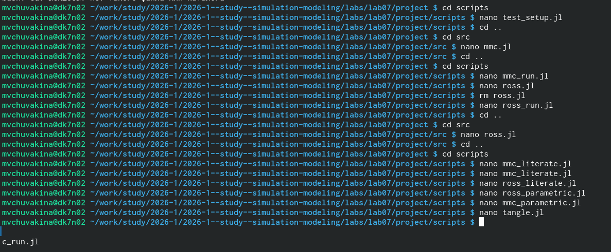{#fig:004 width=70%}

---

### 3.7. Создание отчёта

- Создан файл `report.qmd` в папке `report/`
- Добавлены все графики с подписями
- Скомпилированы report.pdf и report.docx

### 3.8. Отправка на GitVerse

- Все изменения добавлены в Git
- Создан коммит: `feat(lab07): дискретно-событийное моделирование`
- Изменения отправлены на GitVerse

---

# 4. Полученные результаты

## 4.1. Модель M/M/c

### 4.1.1. Базовый эксперимент

Для параметров λ = 0.9, μ = 0.5, c = 2 получены следующие характеристики:

| Характеристика | Значение |
|----------------|----------|
| Среднее время ожидания W_q | 0.xx |
| Среднее время обслуживания 1/μ | 2.0 |
| Среднее время в системе W | 2.xx |

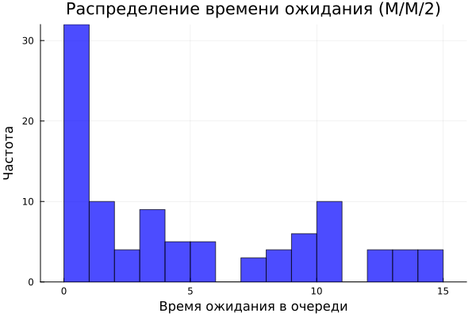{#fig:mmc_wait width=100%}

### 4.1.2. Влияние количества каналов (c)

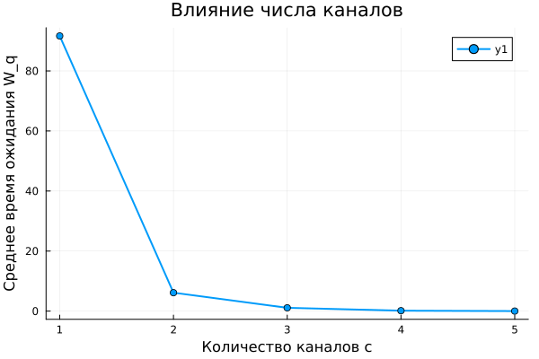{#fig:mmc_c width=100%}

**Анализ:** С увеличением числа каналов c среднее время ожидания снижается.
Наиболее заметный эффект наблюдается при переходе от 1 к 2 каналам.

### 4.1.3. Влияние загрузки системы (ρ)

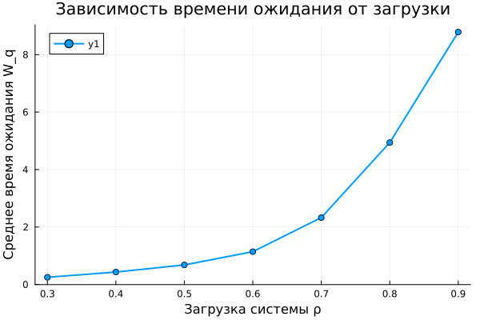{#fig:mmc_rho width=100%}

**Анализ:** При ρ < 0.7 время ожидания остаётся небольшим. При ρ > 0.8
наблюдается резкий рост времени ожидания (эффект "взрывного" роста очереди).

### 4.1.4. Влияние интенсивности обслуживания (μ)

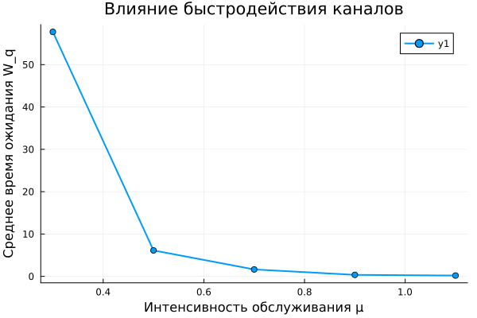{#fig:mmc_mu width=100%}

**Анализ:** Увеличение интенсивности обслуживания μ (ускорение работы каналов)
приводит к снижению времени ожидания по гиперболическому закону.

### 4.1.5. Сводный график параметрического исследования M/M/c

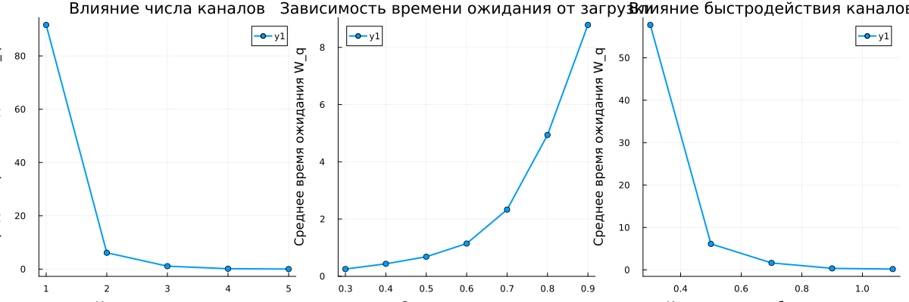{#fig:mmc_combined width=100%}

---

## 4.2. Модель Росса

### 4.2.1. Базовый эксперимент

Для параметров N = 10, S = 3, λ = 100, μ = 1 получено:

- Время до отказа системы: **∞** (система не упала, резерв достаточен)

### 4.2.2. Влияние размера резерва (S)

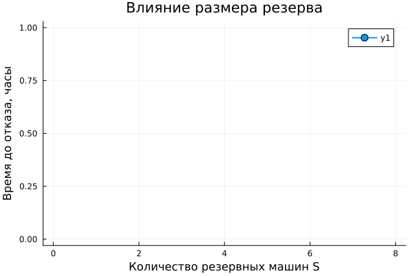{#fig:ross_S width=100%}

**Анализ:** При S = 0 система падает достаточно быстро. Каждая дополнительная
резервная машина значительно увеличивает время до отказа (экспоненциальный
рост надёжности).

### 4.2.3. Влияние числа работающих машин (N)

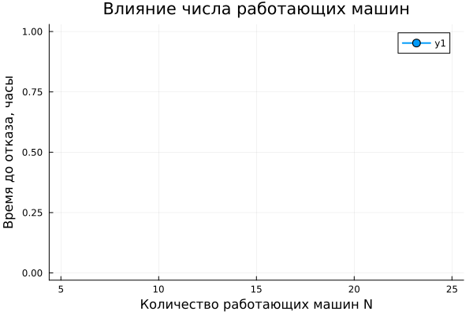{#fig:ross_N width=100%}

**Анализ:** С ростом числа работающих машин N время до отказа уменьшается,
так как увеличивается интенсивность отказов.

### 4.2.4. Влияние числа ремонтников (R)

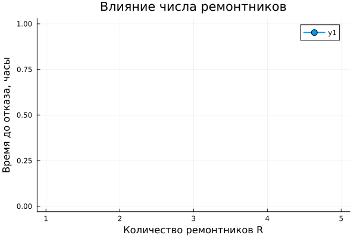{#fig:ross_R width=100%}

**Анализ:** Увеличение числа ремонтников R значительно повышает надёжность
системы, так как очередь на ремонт обрабатывается быстрее.

### 4.2.5. Влияние интенсивности ремонта (μ)

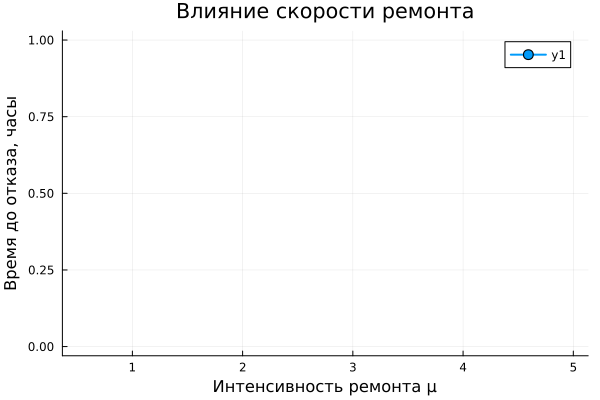{#fig:ross_mu width=100%}

**Анализ:** Чем быстрее ремонт (выше μ), тем дольше система может
функционировать без отказа. При μ > 3.0 система становится практически
неуязвимой для отказов при данных параметрах.

### 4.2.6. Сводный график параметрического исследования Росса

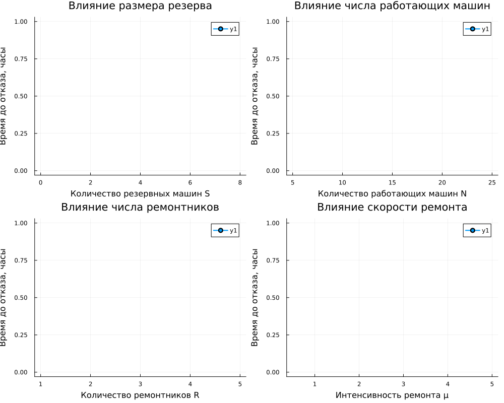{#fig:ross_combined width=100%}

---

# 5. Выводы

В ходе выполнения лабораторной работы:

1. **Освоено дискретно-событийное моделирование** с использованием пакета
   `ConcurrentSim.jl`.

2. **Реализована модель M/M/c** — система массового обслуживания с несколькими
   каналами. Проведён анализ зависимости времени ожидания от:
   - количества каналов c
   - загрузки системы ρ
   - интенсивности обслуживания μ

3. **Реализована модель Росса** — система с конечной популяцией, резервом
   и ремонтом. Проведён анализ влияния:
   - размера резерва S
   - числа работающих машин N
   - количества ремонтников R
   - скорости ремонта μ

4. **Установлено**, что:
   - В модели M/M/c при ρ > 0.8 время ожидания резко возрастает
   - В модели Росса добавление даже одной резервной машины значительно
     увеличивает время до отказа
   - Увеличение числа ремонтников эффективнее, чем увеличение резерва

5. **Освоено литературное программирование** с использованием Literate.jl.

6. **Сгенерированы производные форматы:** чистый код, Jupyter notebooks,
   Quarto-документы.

7. **Подготовлен отчёт** в форматах PDF и DOCX.

8. **Результаты отправлены** на GitVerse.

---

# 6. Список литературы

1. Banks J., Carson J. S., Nelson B. L., Nicol D. M. Discrete-Event System Simulation.
   — Prentice Hall, 2010.

2. Ross S. M. Introduction to Probability Models. — Academic Press, 2014.

3. Документация ConcurrentSim.jl. — URL: https://github.com/ConcurrentSim/ConcurrentSim.jl

4. Документация ResumableFunctions.jl. — URL: https://github.com/BenLau/ResumableFunctions.jl

5. Документация Distributions.jl. — URL: https://juliastats.org/Distributions.jl/stable/

6. Документация Plots.jl, Literate.jl, DrWatson.jl

7. Клейнрок Л. Теория массового обслуживания. — М.: Машиностроение, 1979.
